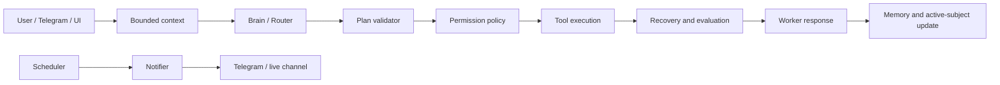

# Ciel 2.0

Ciel is a modular personal AI assistant that can converse, use tools, retain bounded
context, continue multi-step work, and send proactive Telegram notifications. Its
maintained topology uses two model identities:

- **Brain/Router** — intent classification, planning, and result evaluation.
- **Worker** — conversation, generation, synthesis, and formatting.

Optional Router Assistant and Middleware code remains available for experiments, but
both are disabled by default and reuse one of the two standard model identities.

> Experimental personal-agent software. Review the safety model before connecting
> production accounts or enabling unattended execution.

## Current baseline

- Level A and Level B: **pass**.
- Deterministic multi-tool plan validation: **pass**.
- Bounded Active Subject handoff for follow-up turns: **pass**.
- Monthly and weekly planner: **unit-tested, deployed, and live-notification tested**.
- Telegram, CLI, and API/UI entry points share the same `CielCore` runtime.

The living roadmap and evidence are maintained in [improve.md](improve.md). Stable
engineering rules live in [instructionAI/SKILL.md](instructionAI/SKILL.md).

## Architecture



The model plans and composes; deterministic Python enforces plan structure,
permissions, budgets, cancellation boundaries, delivery deduplication, context limits,
and notification cooldowns.

### Core capabilities

| Area | Implementation |
|---|---|
| Routing and execution | `core/llm_connector.py`, `core/router.py`, `core/parallel.py` |
| Conditional continuation | `core/continuation.py`, `core/task_state.py` |
| Plan safety | `core/plan_validation.py`, `core/permissions.py` |
| Context and follow-ups | `core/context.py`, `core/active_subject.py` |
| Memory | ChromaDB RAG, `facts.json`, `user_model.json` |
| Proactivity | `core/triggers.py`, `core/notifier.py`, `core/proactive_setup.py` |
| Monthly/weekly planning | `core/planner_store.py`, `core/planner_triggers.py` |
| Interfaces | CLI, FastAPI/WebSocket, Telegram, React/Tauri UI |
| Tool extension | Auto-discovered `skills/**/*_ops.py` packs |

## Requirements

- Python 3.12+
- At least one supported LLM provider or OpenAI-compatible endpoint
- Docker for container deployment
- Node.js 18+ only for the UI
- Optional Google OAuth credentials for Gmail
- Optional Telegram bot token and numeric chat ID for Telegram mode

Long-term RAG uses ChromaDB, sentence-transformers, and PyTorch. If that stack cannot
initialize, Ciel disables RAG rather than taking down the assistant.

## Installation

```bash
git clone <repository-url> ciel-2.0
cd ciel-2.0
python -m venv myenv
```

PowerShell:

```powershell
myenv\Scripts\Activate.ps1
pip install -r requirements.txt
```

Bash:

```bash
source myenv/bin/activate
pip install -r requirements.txt
```

Create a private `.env` in the repository root. Do not commit it.

```dotenv
# Standard two-model topology
BRAIN_PROVIDER=custom
BRAIN_MODEL=<brain-model>
WORKER_PROVIDER=custom
CODER_MODEL=<worker-model>
API_KEY=<provider-key>
BASE_URL=https://provider.example/v1

# Optional roles remain off
ROUTER_ASSISTANT_ENABLED=false
MIDDLEWARE_ENABLED=false

# Content filtering and destructive-tool confirmation are independent
SAFETY_OPEN=true
DISABLE_SAFETY_GATE=false

# Optional Telegram interface
TELEGRAM_BOT_TOKEN=<bot-token>
TELEGRAM_CHAT_ID=<numeric-chat-id>

# Disable capabilities unavailable on a headless server
DISABLED_SKILL_MODULES=vision_ops
```

`CODER_MODEL` is the Worker model variable. `WORKER_MODEL` is not read from `.env`.
Provider-specific options and all feature flags are defined in
`agent_system/config.py`.

## Run

### CLI

```bash
python main.py
python main.py --voice --speak
```

### API and UI

```bash
python main_api.py
cd ui
npm install
npm run dev
```

The backend exposes `GET /health`, `GET /skills`, `POST /tts`, and `WS /ws`.

### Telegram

```bash
python main_telegram.py
```

Only the configured `TELEGRAM_CHAT_ID` is accepted. High-risk actions use an inline
confirmation keyboard, and `/cancel` requests cooperative cancellation at the next
tool boundary.

### Docker

```bash
# API service
docker compose -f docker/docker-compose.api.yml up -d --build

# Telegram service
docker compose -f docker/docker-compose.telegram.yml up -d --build
```

The services share bind-mounted `ciel_data/`, `ciel_workspace/`, and `agent_output/`.
Run only one Ciel front end against that state at a time; the current JSON/SQLite state
is designed for one process.

For every source, dependency, or Dockerfile change, rebuild and recreate:

```bash
docker compose -f docker/docker-compose.telegram.yml up -d --build --force-recreate
docker compose -f docker/docker-compose.telegram.yml ps
docker compose -f docker/docker-compose.telegram.yml logs -f --tail=100 ciel-telegram
```

The Telegram service intentionally has no HTTP health endpoint. Verify it with Compose
status and the `[Telegram] Bot online` log. See [docker/README.md](docker/README.md) for
the complete deployment contract.

## Monthly and weekly planning

Plans are durable structured data, not chat history:

- Monthly outcomes: `ciel_data/planner.db::monthly_goals`
- Weekly actions: `ciel_data/planner.db::weekly_tasks`
- Immediate loose tasks: `ciel_workspace/todos.json`

Available planner tools:

| Monthly | Weekly |
|---|---|
| `add_monthly_goal` | `add_weekly_task` |
| `list_monthly_goals` | `list_weekly_plan` |
| `update_monthly_goal` | `update_weekly_task` |
| `complete_monthly_goal` | `complete_weekly_task` |

Automatic summaries are opt-in:

```dotenv
PROACTIVE_ENABLED=true
PROACTIVE_TRIGGERS=monthly_plan,weekly_plan
PLANNER_TIMEZONE=Asia/Ho_Chi_Minh
PLANNER_MONTHLY_DAY=1
PLANNER_MONTHLY_HOUR=8
PLANNER_MONTHLY_MINUTE=0
PLANNER_WEEKLY_WEEKDAY=0
PLANNER_WEEKLY_HOUR=8
PLANNER_WEEKLY_MINUTE=0
```

Successful deliveries use stable month/week keys in `ciel_data/state/notify.json`, so
container restarts and repeated trigger polls do not resend the same summary. Failed
deliveries remain retryable.

## Safety model

- `SAFETY_OPEN` controls Brain content filtering only.
- `DISABLE_SAFETY_GATE` controls destructive-tool confirmation only.
- Unknown or malformed multi-tool plans stop before execution.
- Risky unattended actions are deferred; silence is never consent.
- Outbound sends are deduplicated per recipient and turn.
- File tools are sandboxed to `ciel_workspace/` and `agent_output/`.
- `.env`, `credentials.json`, OAuth tokens, and runtime data must stay untracked.

See [instructionAI/safety_and_risk.md](instructionAI/safety_and_risk.md) for the full
contract.

## Tests

```bash
# Maintained unit regression path
python -m backtest.run_all --unit-only

# Unit and live integration tests; requires provider credentials
python -m backtest.run_all --skip-exploratory

# Planner-only deterministic suite
python -m backtest.test_planner

# Focused safety and routing suites
python -m backtest.test_quality_guards
python -m backtest.test_plan_validation
python -m backtest.test_conversation_bugs
```

Keep durable tests under `backtest/test_*.py`; do not accumulate one-off smoke-test
modules. Live deployment checks should use isolated temporary state and must leave
production planner and notifier data unchanged.

## State and repository layout

```text
agent_system/       Model configuration, prompts, and model clients
core/               Runtime orchestration and deterministic capability tiers
skills/             Auto-discovered tool packs
ciel_data/          Persistent private state, RAG, logs, planner database
ciel_workspace/     Sandboxed working files and immediate todos
agent_output/       Generated reports and deliverables
backtest/           Maintained regression and integration suites
docker/             Dockerfiles, Compose files, deployment notes
ui/                 React/Tauri interface
instructionAI/      Stable project memory for future AI sessions
improve.md          Living roadmap and pass criteria
note.md             Dated operational journal
```

## Documentation

- [AI entry point](instructionAI/SKILL.md)
- [Architecture](instructionAI/architecture.md)
- [Conventions](instructionAI/conventions.md)
- [Data and memory](instructionAI/data_pipeline.md)
- [Safety and risk](instructionAI/safety_and_risk.md)
- [Voice and interfaces](instructionAI/voice_and_interface.md)
- [UI details](ui/README.md)
- [Roadmap](improve.md)

## License and responsibility

This repository is an experimental personal project. The operator is responsible for
provider usage, credentials, automated messages, shell commands, filesystem changes,
and any external actions performed through configured tools.
