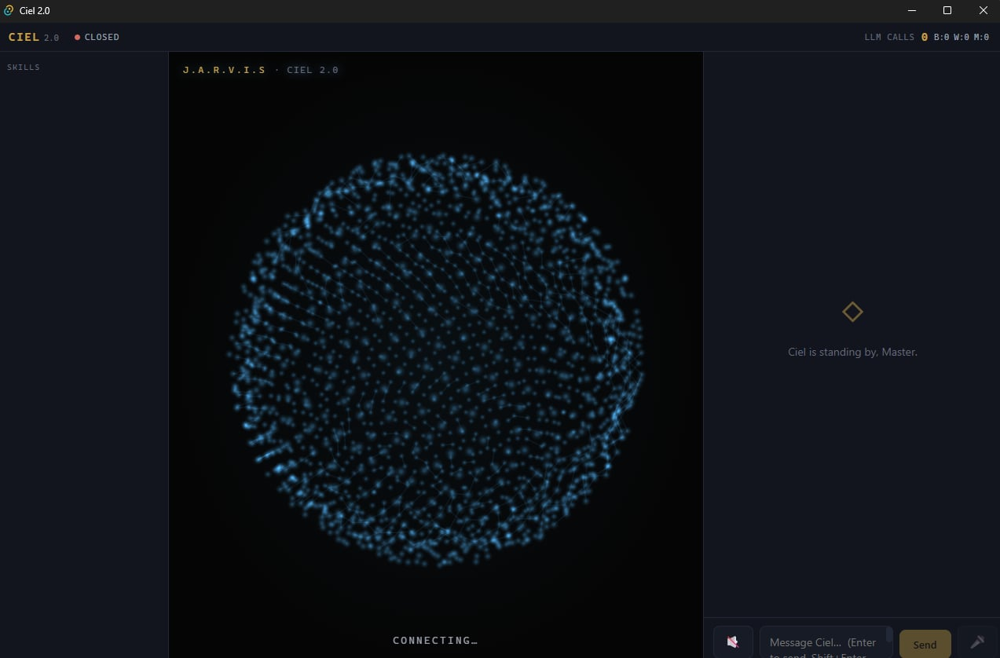
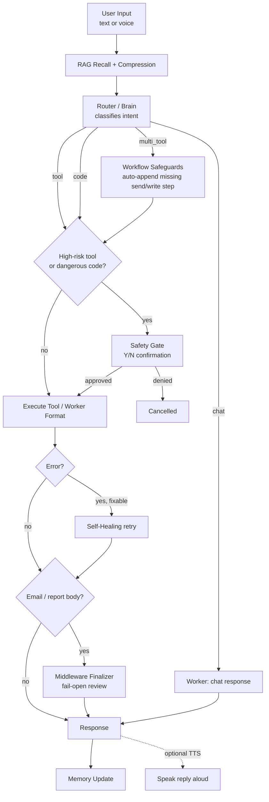

<p align="center">
  <b>🛰️ CIEL 2.0</b>
</p>

<h1 align="center">Ciel 2.0</h1>

<p align="center">
  An autonomous AI assistant built on a three-tier <b>Brain → Worker → Middleware</b> pipeline —
  it routes intent, executes real tools, self-audits its own output before it reaches you or your inbox,
  and can now listen and talk back.
</p>

<p align="center">
  
  <br>
  <em>The voice-first interface: an audio-reactive particle orb that reacts to Ciel's real state (idle / listening / thinking / speaking).</em>
</p>

<p align="center">
  <a href="architect.md">Architecture</a> ·
  <a href="note.md">Live Status</a> ·
  <a href="PROMPT_INVENTORY.md">Prompts</a> ·
  <a href="ui/README.md">UI</a> ·
  <a href="autonomous_pipeline/architect.md">MLOps Pipeline</a>
</p>

<p align="center">
  <em>Internal research / experimental project — see <a href="#license--notes">License / Notes</a> before pointing this at production data.</em>
</p>

---

## Table of Contents

- [What this is](#what-this-is)
- [Prerequisites](#prerequisites)
- [Quick Start](#quick-start)
- [Feature Overview](#feature-overview)
- [How It Works](#how-it-works)
- [Voice I/O](#voice-io)
- [Observability & Cost](#observability--cost)
- [Backend API](#backend-api)
- [File Structure](#file-structure)
- [Customization](#customization)
- [Tips for Better Results](#tips-for-better-results)
- [Contributing](#contributing)
- [License / Notes](#license--notes)

---

## What this is

Ciel is a personal AI agent that does more than answer questions — it routes your request to the right internal logic, executes **real tools** (filesystem, shell, email, trading data, web search, git, screen control), and checks its own work before responding. It is not a single LLM call wrapped in a chat UI; it's a pipeline with three distinct model roles and a safety layer that is intentionally decoupled from content filtering.

Three layers, in order of importance:

- **The core** — the `Brain → Worker → Middleware` loop in `core/`. Every request goes through it, and it's the part to understand first.
- **The tool packs** — `skills/`, the extension surface. Adding a capability means writing one tool file, not touching routing.
- **The optional layers** — a desktop/browser **UI** (`ui/`), a self-training **MLOps pipeline** (`autonomous_pipeline/`), and **voice I/O**. None are required to run Ciel from the CLI.



Every box above is a real module, not an aspiration — `core/router.py` (Router), `agent_system/models/worker.py` (Worker), `core/middleware.py` (Middleware), `core/recovery_manager.py` (Self-Healing). See [architect.md](architect.md) for the file-by-file breakdown.

---

## Prerequisites

| Requirement | Needed for | Notes |
|---|---|---|
| **Python 3.12+** | Core backend | `pandas-ta` (in `requirements.txt`) requires Python >=3.12 and has no PyPI distribution for older versions — confirmed live via a CI run that failed on 3.10 with "no matching distribution." Use a fresh virtualenv on a new clone. |
| **pip** | Dependency install | `pip install -r requirements.txt` |
| **At least one LLM provider API key** | Brain / Worker / Middleware | Gemini, DeepSeek, and/or Vilao. Ollama works fully offline if you'd rather not use a cloud key. |
| **Node.js 18+ and npm** | UI only | Only needed if you run `ui/`. Skip entirely for CLI-only use. |
| **Rust + MSVC C++ Build Tools** | Desktop (Tauri) build only | Only for `npm run tauri dev/build`. WebView2 ships with Windows 11 already. |
| **Google OAuth credentials** | Gmail tools | `credentials.json` + token — only if you use `search_gmail`/`send_gmail_message`/etc. Missing it disables *only* the Gmail tools; the rest of Ciel runs normally. |
| **Microphone + internet** | Voice I/O only | Default STT/TTS backends (`google`, `edge-tts`) are free and need no key, but do need a network connection. Installed via `requirements.txt`. |
| **TwelveData / Telegram tokens** | Trading tools, proactive digest | Optional; those tool packs degrade gracefully without them. |

> **Note on `torch`/RAG:** long-term memory (ChromaDB + `sentence-transformers`) needs a working PyTorch install. On some environments PyTorch's `c10.dll` fails to initialize (missing VC++ Redistributable, or a CPU without AVX). Ciel detects this and disables RAG gracefully rather than crashing — you lose long-term memory, not the whole system.

---

## Quick Start

### 1. Clone and install

**Bash / Zsh**
```bash
git clone <your-repo-url> ciel-2.0
cd ciel-2.0
python -m venv myenv
source myenv/bin/activate
pip install -r requirements.txt
```

**PowerShell**
```powershell
git clone <your-repo-url> ciel-2.0
cd ciel-2.0
python -m venv myenv
myenv\Scripts\Activate.ps1
pip install -r requirements.txt
```

### 2. Configure `.env`

Create a `.env` file in the repo root (no example is checked in — build it from the keys below):

```dotenv
# --- Providers (mix and match per tier) ---
BRAIN_PROVIDER=vilao          # vilao | deepseek | gemini | ollama
BRAIN_MODEL=alic/qwen3.7-max
WORKER_PROVIDER=deepseek
CODER_MODEL=deepseek-chat     # NOT "WORKER_MODEL" — see gotcha below
GEMINI_API_KEY=...
DEEPSEEK_API_KEY=...
VILAO_API_KEY=...

# --- Safety (two INDEPENDENT flags — do not couple them) ---
SAFETY_OPEN=true              # relaxes Brain CONTENT filtering only
VILAO_SAFETY_BYPASS=true
DISABLE_SAFETY_GATE=false     # keeps the destructive-tool Y/N gate ACTIVE (recommended default)

# --- Optional tiers / integrations ---
MIDDLEWARE_ENABLED=true
TWELVEDATA_API_KEY=...
TELEGRAM_BOT_TOKEN=...
TELEGRAM_CHAT_ID=...

# --- Agent loop (observe → re-plan → act). Costs nothing when it does not fire. ---
AGENT_LOOP_ENABLED=true
AGENT_LOOP_MAX_ROUNDS=2       # extra rounds beyond the first
AGENT_LOOP_MAX_SECONDS=120    # wall-clock ceiling, checked before EVERY step

# --- Parallel tool execution ---
AGENT_PARALLEL_ENABLED=true
AGENT_PARALLEL_MAX_WORKERS=4

# --- Permissions (comma-separated tool names) ---
CIEL_DENY_TOOLS=              # refused outright; no grant or open gate can reach past this
CIEL_AUTO_TOOLS=              # extra tools to treat as read-only / never prompt

# --- Escape hatch: plan email sends with regex instead of the Brain. Off by default;
#     only needed for a provider whose content filter blocks email routing calls. ---
EMAIL_BYPASS_BRAIN=false

# --- Optional voice I/O (all have working defaults) ---
STT_BACKEND=google            # google | whisper | gemini
TTS_BACKEND=edge              # edge | pyttsx3 | space
TTS_VOICE=vi-VN-HoaiMyNeural  # or vi-VN-NamMinhNeural
```

> **Gotcha:** `agent_system/config.py` reads the Worker model from `CODER_MODEL`, not `WORKER_MODEL`. A `.env` entry literally named `WORKER_MODEL` is silently ignored.

### 3. Run the CLI

```bash
python main.py
```

Type a request at the `Master:` prompt. High-risk actions (file delete, shell exec, sending email, etc.) ask for a `Y/N` confirmation unless `DISABLE_SAFETY_GATE=true`.

**Talk to it (optional):**
```bash
python main.py --voice --speak     # speak requests, hear replies
```
- `--voice`: press Enter on an empty line to speak, or type to override; `:v` does a one-off voice capture in any mode.
- `--speak`: Ciel reads each reply aloud (the printed transcript is unchanged).
- Test each modality standalone first: `python -m core.voice_input` (mic → text) and `python -m core.speech_output "Xin chào Master"` (text → speech).

### 4. (Optional) Run the API server + UI

**Bash / Zsh**
```bash
python main_api.py &                    # backend: ws://localhost:8000/ws + REST
cd ui && npm install && npm run dev     # browser UI: http://localhost:1420
```

**PowerShell**
```powershell
Start-Process python main_api.py
cd ui; npm install; npm run dev
```

In the UI, click the 🔇 → 🔊 button beside the input box to have Ciel read replies aloud (uses the same neural voice as the CLI). For the wrapped desktop app instead of the browser tab: `cd ui && npm run tauri dev` — see [ui/README.md](ui/README.md).

---

## Feature Overview

### Routing & Execution
- **Three-Tier Architecture** — Brain (intent routing/planning) → Worker (content/code generation) → Middleware (scoped finalizer for email/report bodies, fail-open by design).
- **Four intent types** — every turn is classified as `chat`, `tool`, `code`, or `multi_tool`, each with its own execution path.
- **Agent loop — observe, re-plan, act** (`core/continuation.py`) — a plan is a flat list of calls chosen before anything runs, so *"check git status, and if it's clean, commit"* used to be **structurally unrepresentable**. The loop closes that: after a plan executes, five deterministic signals decide whether to look again with the real results in view (conditional wording · an unresolved `{step_N}` reaching a tool · a step that failed while later steps ran · fan-out over a set of unknown size · an optional planner hint). Whether to loop is decided in **pure Python**, so an ordinary request pays **zero extra tokens** and no model — however confused — can make it unbounded. Every ceiling (rounds, planner calls, wall-clock, steps per round) is enforced in code, and any failure quietly keeps the first round's answer.
- **Parallel tool execution** (`core/parallel.py`) — provably independent steps in one plan run concurrently. Opt-in per tool (`parallel_safe` in a skill's factory), because auto-registration means a blacklist would silently parallelise a newly added mutating tool. Measured on tool time alone: 9.3× on file fan-out, 2.3× on web scrapes.
- **Durable task state** (`core/task_state.py`) — a job interrupted by a crash, restart or closed terminal leaves a record instead of vanishing; the CLI reports it on the next launch. `đang làm gì` / `status` is answered straight from that record — **0 LLM calls, ~0.1s**.
- **Deterministic Workflow Safeguards** — if a plan is missing its terminal send step (email intent + address) or write step (explicit path + write verb), it's auto-appended in code, not left to the Brain to remember. The same layer enforces an explicitly-requested email subject (`subject exactly '...'`) and blocks any unsynthesized `[SYNTHESIZE…]`-style placeholder from reaching a file or an inbox — matched by pattern, so it holds even when the Brain paraphrases the marker.
- **Dependent multi-tool steps** — a later step can consume an earlier one's real output via `{{prev}}` / `{{step_N}}` tokens in its args, substituted deterministically at run time (no LLM). Independent-tool plans are unchanged.
- **Self-Healing with a Skip-List** — multi-attempt autonomous recovery for tool/code errors, but skips error classes no retry can ever fix (missing library, network timeout, geo-restriction) instead of burning a guaranteed-to-fail Worker call.
- **Memory-aware recall fallback** — when a memory question is routed to a workspace-inspection tool that comes back empty, Ciel falls back to the recalled long-term context (labeled "unverified from workspace") instead of returning a bare directory listing.
- **Dated, sourced web search** — `stealth_search` reads Google News RSS first (free, no API key), falling back to DuckDuckGo, so every hit carries a real publication date and outlet; undated results are labeled so the model can't invent one. A generic "what's the news" pulls the top-stories feed rather than keyword-matching articles *titled* "top news headlines", recency is enforced on the real timestamps, and section landing pages are dropped. The query is built in **your** language — a Vietnamese question returns Vietnamese outlets, an English one stays international.

### Safety
- **Decoupled Safety Model** — content-filter permissiveness (`SAFETY_OPEN`) and the destructive-action confirmation gate (`DISABLE_SAFETY_GATE`) are independent flags on purpose; a denied confirmation can never be silently overridden by the content-filter setting.
- **Three-way permissions** (`core/permissions.py`) — every `(tool, args)` resolves to `AUTO` (read-only, never interrupts), `ASK`, or `DENY` (`CIEL_DENY_TOOLS` — refused outright, unreachable by any grant or by an open safety gate).
- **Approve the plan, not the fragments** — a multi-step plan raises **one** prompt listing every step that needs approval, **before the first step runs**. Declining means *nothing ran*; the old per-call gate asked about step 3 only once steps 1–2 had already happened. Approvals are scoped to the exact `(tool + args)` reviewed, so a step the agent loop invents later — same tool, different arguments — is still asked about.
- **Session grants** — answer `A` at a prompt to stop being asked about that one tool for the rest of the run. Held in memory only, never written to disk, and refused for deny-listed tools.
- **High-Risk Tool Gate** — eight tools that touch the outside world (`delete_file`, `execute_shell_command`, the three Gmail send tools, `trash_email`, `git_confirm_push`, `vision_act`) require an explicit `Y/N` before running.
- **Confirmations survive a restart** — a preview tool declares its own follow-up via `make_result(confirm=…)`; a later bare "yes" executes it with **zero LLM calls**, and the pending action is persisted, so it is not lost if the process dies. Only one can be outstanding: a new risky request while one is pending is refused deterministically rather than silently dropping it.
- **Dangerous-Code Gate** — any Worker-written script or file (not just the known high-risk tools) is scanned for destructive patterns — drive format, `shutil.rmtree`, fork bombs — and gated behind the same confirmation.
- **Sandboxed Filesystem** — file tools are quarantined to `ciel_workspace/` / `agent_output/`; paths that escape raise an error.

### Memory & Data
- **Hybrid RAG Memory** — short-term chat history plus long-term ChromaDB semantic memory, with two-tier compression (regex/structural, then Worker) to keep recalled context cheap.
- **Email Send Pipeline** — market/asset reports, research/news digests, and document summaries each gather real tool data *first*, then compose; anti-fabrication rules block invented prices and hollow "attached" shells, and every outbound body passes one deterministic sanitizer.

### Voice I/O
- **Speech-to-Text (CLI)** — talk to Ciel; `core/voice_input.py` captures the mic and transcribes it, then feeds the text into the exact same pipeline the keyboard uses.
- **Text-to-Speech (CLI + UI)** — Ciel talks back with free neural voices (Vietnamese by default). A deterministic normalizer strips markdown/emojis/tags before speaking, so the persona and text formatting are never dumbed down for voice.
- **Swappable backends** — STT and TTS backends are selected via `.env`; defaults are free and need no API key. See [Voice I/O](#voice-io).

### Observability & Cost
- **Full Audit Trail** — every RAG recall, route decision, tool result, healing attempt, and Middleware review is logged to `ciel_data/logs/thoughts.log`.
- **Token-Precise Cost Tracking** — every real LLM call logs its exact provider token counts; live vitals show per-tier tokens and estimated USD, and `scripts/cost_report.py` aggregates spend over time. See [Observability & Cost](#observability--cost).

### Interface
- **Audio-Reactive Orb** — a full Three.js particle orb (2000 particles, connecting lines, travelling "electrons") is the centerpiece. It reflects Ciel's real state (idle / listening / thinking / speaking) and pulses to the actual TTS voice via an `AnalyserNode`. Layout: skills (left) · orb (center) · conversation (right).
- **Desktop/Browser UI** — React + Tauri v2, browser-first and desktop-wrappable with zero code changes between the two. The skill list and live activity feed are 100% backend-driven.
- **Vision & Screen Control** — PyAutoGUI + Gemini Vision for direct UI interaction when no API/tool exists for a task.
- **Multi-Provider** — Brain, Worker, and Middleware can each run a different provider (Vilao, DeepSeek, Gemini, Ollama), swappable via `.env` with no code changes.

### Autonomy
- **Autonomous MLOps Pipeline** (`autonomous_pipeline/`) — a background daemon that simulates a Master, runs real Ciel tasks, audits them with an independent Judge model, and grows a Worker fine-tuning dataset — including a Chaos Injector that manufactures hard edge cases (timeouts, missing files, API errors) the normal loop never generates on its own.
- **Proactive Scheduler** — zero-token standby background tasks (e.g. an 08:00 market/Gmail digest, a 23:00 memory cleanse) that call tools directly and never pollute conversational memory.

---

## How It Works

1. **User input arrives** at `CielCore.process()` (`core/llm_connector.py`) — from the CLI loop, the WebSocket API, a voice transcript, or the autonomous pipeline's task generator.
2. **RAG recall** searches ChromaDB for semantically relevant past context and injects a compressed summary into the prompt — skipped for short/low-relevance queries to avoid noise.
3. **The Router (Brain)** classifies intent into `chat`, `tool`, `code`, or `multi_tool` and returns a structured plan.
4. **Workflow safeguards** run before execution: if the plan implies a send or write action but the corresponding step is missing, it's appended deterministically.
5. **The Safety Gate** intercepts high-risk tool calls and any code/file write matching a dangerous pattern, blocking until the user approves (unless the gate is disabled for unattended flows).
6. **Execution** happens via `ToolManager` — real API calls, file writes, shell commands. Errors trigger **Self-Healing**, which retries with an escalating strategy but skips error classes it knows it can't fix.
7. **The Worker** formats the raw tool result into the final response, always instructed to report only what the tool actually returned — never to invent data.
8. **Middleware** (if enabled) reviews outbound email/report bodies specifically, catching topic mismatches and internal contradictions a regex sanitizer can't — and edits the body in place rather than blocking, failing open on any error.
9. **The response returns** to the user (and is optionally spoken aloud), and the exchange is saved to memory, with overflow archived into the long-term vector store.

### What makes this different

Most agent frameworks treat "the LLM decided to do X" as sufficient. Ciel treats the LLM's decision as a *proposal* that gets checked at multiple points: a workflow safeguard verifies the plan is actually complete, a safety gate verifies risky actions are approved, a self-healing skip-list verifies retries aren't wasted on unfixable errors, and a Middleware tier verifies the final output doesn't contradict itself — all *before* anything is written to disk or sent to a real inbox. None of these checks are another LLM call pretending to be certain; most are deterministic code, and the one LLM-based check (Middleware) is scoped narrowly and fails open specifically so it can never become the single point of failure for a send.

---

## Voice I/O

Voice is a modality layer, not a rewrite — a spoken sentence becomes text and flows through the same `run_step()` the keyboard uses, and a reply is spoken *after* a deterministic normalizer cleans it. The prompts and persona are never changed to be "speech-friendly"; the text UI, HUD, and email keep their rich formatting.

### Speech-to-Text (`core/voice_input.py`)

Mic capture uses `sounddevice` (bundles PortAudio — installs cleanly on Windows, no PyAudio/compiler). Energy-based endpointing auto-calibrates ambient noise and stops on silence.

| `STT_BACKEND` | Engine | Notes |
|---|---|---|
| `google` *(default)* | SpeechRecognition → free Google Web Speech | No API key, supports vi-VN, needs internet |
| `whisper` | faster-whisper (offline) | Best Vietnamese accuracy; install `faster-whisper` |
| `gemini` | google-genai | Needs `GEMINI_API_KEY` |

### Text-to-Speech (`core/speech_output.py`)

A `to_speech()` normalizer strips markdown, emojis, `[TAG]`-style headers, code blocks, and URLs (numbers preserved) before synthesis — the same pattern as the email sanitizer.

| `TTS_BACKEND` | Engine | Notes |
|---|---|---|
| `edge` *(default)* | edge-tts (Microsoft neural voices) | Free, no key, vi-VN neural; playback via built-in Windows MCI |
| `pyttsx3` | Offline OS/SAPI voices | No internet; weaker Vietnamese |
| `space` / `rvc` | mikuTTS Hugging Face Space (RVC character voice) | Experimental; ~25s/utterance, may sleep — not a default |

Prosody knobs: `TTS_VOICE`, `TTS_RATE`, `TTS_PITCH`, `TTS_VOLUME`. RVC knobs (only for `TTS_BACKEND=space`): `RVC_MODEL`, `RVC_TTS_VOICE`, `RVC_F0_UP`, `RVC_F0_METHOD`, `RVC_INDEX_RATE`, `RVC_PROTECT`, `RVC_SPACE`.

### In the UI

Voice **output** is wired end-to-end: the 🔊 toggle subscribes to the reply event, POSTs the text to the backend `/tts` endpoint (which runs the **same** `to_speech()` + edge-tts as the CLI), and plays the returned MP3 — so the browser gets identical quality with no client-side voice code. Voice **input** in the UI is still a typed-only stub (`ui/src/io/input/VoiceInput.tsx`).

> **GPU note:** none of the default voice backends use your local GPU — edge-tts and the RVC Space run on Microsoft/HF servers (your machine only does HTTP + playback), and `pyttsx3` is CPU. A *locally downloaded* neural TTS/RVC model would be GPU-heavy and is only worth it with a real NVIDIA GPU + CUDA `torch`.

---

## Observability & Cost

Ciel is designed to be inspectable — you can always answer "what did it do and what did it cost?"

- **`thoughts.log`** (`ciel_data/logs/thoughts.log`) — the full raw audit trail: RAG recalls, route decisions, tool results, healing attempts, Middleware reviews, and one `[LLM_CALL] model=<id> in=<n> out=<n> total=<n>` line per real model call. `scripts/format_thoughts_log.py` renders it into a readable Markdown/JSONL view for a specific turn.
- **Live cost in vitals** — the API's vitals feed reports real per-tier call counts, **exact** token totals (from the provider), and an **estimated** USD cost, live for the session. Prices live in `core/cost.py` and are overridable without code changes via `ciel_data/model_pricing.json` (unknown models fall back to $0 but are still counted).
- **Cumulative report** — `python -m scripts.cost_report [--since-days N] [--json]` mines the log and aggregates token usage and estimated spend by tier, model, and day.
- **Prompt harness** — `python -m scripts.prompt_harness --min-count 3` mines the log for recurring failure patterns and points at which prompt/file is actually worth patching — deterministic, never auto-edits.

---

## Backend API

`python main_api.py` serves a FastAPI app (default `http://localhost:8000`). The UI talks to it; you can too.

| Endpoint | Purpose |
|---|---|
| `WS /ws` | Main channel — chat messages, streamed thoughts, live vitals, and `Y/N` safety confirmations. |
| `GET /health` | Liveness/readiness probe (`ready` flips true once the agent boots). |
| `GET /skills` | Dynamic manifest of loaded skill modules + tools — the UI renders its skill panels from this, so a new `skills/*.py` file appears with zero frontend edits. |
| `POST /tts` | `{ "text": "..." }` → normalized edge-tts MP3 (`audio/mpeg`). Powers the UI's read-aloud toggle; `204` when there's nothing speakable. |

---

## File Structure

```text
Ciel 2.0/
├── main.py                    # CLI entry point (text + voice)
├── main_api.py                 # FastAPI + WebSocket server for the UI (+ /skills, /health, /tts)
├── architect.md                # Full architecture map (start here for deep dives)
├── note.md                    # Live status / rolling changelog
├── requirements.txt
│
├── core/                       # Main orchestration — the part every request goes through
│   ├── llm_connector.py        # CielCore: routes → executes → responds
│   ├── router.py                # Brain-based intent classification
│   ├── middleware.py            # Email/report finalizer (Tier 3)
│   ├── recovery_manager.py      # Self-healing with skip-list
│   ├── rag_manager.py           # ChromaDB long-term memory
│   ├── scheduler.py             # Proactive background tasks (e.g. daily digest)
│   ├── tool_manager.py          # Tool registry & execution
│   ├── cost.py                  # LLM pricing + cost estimation
│   ├── voice_input.py           # CLI speech-to-text (swappable STT backends)
│   └── speech_output.py         # CLI/UI text-to-speech (normalizer + swappable TTS backends)
│
├── agent_system/               # Brain/Worker/Middleware LLM models + LangGraph pipeline
│   ├── models/                  # brain.py, worker.py, middleware.py
│   ├── graph/                   # Multi-step structured code-gen pipeline
│   └── utils/usage.py           # Provider token extraction for cost tracking
│
├── skills/                     # Tool packs — the extension surface
│   ├── internal/                # filesystem, OS/shell, productivity, vision
│   └── external/                # Gmail, trading, Telegram, GitHub, web search, documents
│
├── ui/                         # React + Tauri v2 frontend (optional) — see ui/README.md
│   └── src/
│       ├── orb.ts               # Three.js audio-reactive particle orb (framework-agnostic)
│       ├── components/Orb.tsx   # React wrapper driving the orb from conversation state
│       └── io/                  # modality layer: input/ (text + voice mic), output/ (transcript, speaker+analyser)
│
├── autonomous_pipeline/        # Self-running MLOps daemon (optional)
│   ├── orchestrator.py          # Background scheduler
│   ├── task_generator.py        # Simulated Master
│   ├── data_pipeline.py         # Judge audit + dataset builder
│   └── chaos_injector.py        # Adversarial edge-case injection
│
├── scripts/                    # format_thoughts_log.py, prompt_harness.py, cost_report.py
├── email_template/             # Structured templates for outbound email bodies
├── backtest/                   # Integration/stress tests
├── instructionAI/              # AI-assistant instruction files (start with SKILL.md)
├── ciel_workspace/              # Sandbox for user files, logs, screenshots
└── agent_output/                # Default output location for AI-generated code
```

---

## Customization

| I want to... | Edit this |
|---|---|
| Change Ciel's persona / tone | `persona/official_ciel_personality.txt` (the single persona file) |
| Find which prompt to edit for any behavior | [`PROMPT_INVENTORY.md`](PROMPT_INVENTORY.md) — maps every prompt, the runtime assembly chain, and the traps (e.g. the per-skill `*_SYSTEM_PROMPT` manuals are inert — edit `_TOOL_HINTS`/docstrings instead) |
| Add a new tool/capability | New file under `skills/internal/` or `skills/external/` exposing a `get_*_tools()` factory — auto-discovered by `core/tool_manager.py`; the UI skill grid updates automatically (served from `GET /skills`) |
| Switch LLM providers | `.env` — `BRAIN_PROVIDER`, `WORKER_PROVIDER`, plus each provider's model name (`BRAIN_MODEL`, `CODER_MODEL`) |
| Add/remove a high-risk tool from the safety gate | `core/llm_connector.py` — `_HIGH_RISK_TOOLS` / `_RISK_DESCRIPTIONS` |
| Tune what counts as "dangerous code" | `core/llm_connector.py` — `_find_dangerous_code_patterns()` |
| Change an email template's structure | `note.md` (templates section) and `email_template/` |
| Adjust RAG recall sensitivity | `core/rag_manager.py` — `MIN_QUERY_LENGTH`, `MIN_RELEVANCE_SCORE` |
| Enable/scope the Middleware tier | `.env` — `MIDDLEWARE_ENABLED`, `MIDDLEWARE_SCOPE`, `MIDDLEWARE_MAX_PASSES` |
| Change the CLI/UI voice, STT/TTS backend, or prosody | `.env` — `STT_BACKEND`, `TTS_BACKEND`, `TTS_VOICE`, `TTS_RATE`/`TTS_PITCH`, and `RVC_*` for the experimental character voice |
| Tune what the TTS reads aloud (strip more/less) | `core/speech_output.py` — `to_speech()` normalizer |
| Set real per-model prices for cost tracking | `ciel_data/model_pricing.json` (overrides `core/cost.py` defaults, no code change) |
| Add a UI-side voice *input* modality | `ui/src/io/input/VoiceInput.tsx` — see [ui/README.md](ui/README.md) |
| Change the autonomous pipeline's task cadence | `autonomous_pipeline/orchestrator.py` |

---

## Tips for Better Results

**Keep the safety gate on unless you mean it.** `DISABLE_SAFETY_GATE=true` is meant for the autonomous pipeline and other fully unattended flows — not everyday CLI use. The two safety flags are separate precisely so you can loosen content filtering without also losing the destructive-action confirmation.

**Give tasks explicit output specs.** Both the live Router and the autonomous pipeline's task generator produce noticeably better (less hallucinated) results when the request states *what* to output, not just *what to do* — "report only the closing price value" beats "get me the BTC price."

**Test voice modalities standalone first.** `python -m core.voice_input` and `python -m core.speech_output "..."` verify your mic and speaker independently before you rely on `--voice`/`--speak` in a full session. For fluid conversation keep `TTS_BACKEND=edge` (the `space`/RVC backend adds ~25s per reply).

**Watch `thoughts.log`, not just the console.** It's the full raw audit trail; `scripts/format_thoughts_log.py` renders a readable view for a specific turn, and `scripts/cost_report.py` tells you what a run actually cost.

**Run `prompt_harness.py` before hand-editing a prompt.** `python -m scripts.prompt_harness --min-count 3` mines `thoughts.log` for recurring failure patterns and tells you which file/prompt is actually worth patching, instead of guessing from a handful of anecdotal bad responses.

**Don't skip the RAG dependency check.** If you see `[WinError 1114] ... c10.dll` on boot, that's PyTorch failing to initialize (usually a missing VC++ Redistributable or a CPU without AVX) — not a code bug. Ciel disables RAG gracefully and keeps running.

---

## Contributing

This is currently an internal/experimental project without a formal contribution process. If you fork it: keep the safety-flag separation intact, prefer deterministic checks over trusting the Brain to "remember" a rule, and read `architect.md`'s Changelog section before touching `core/llm_connector.py` — most of its logic exists because of a specific, previously-observed failure.

## Acknowledgements

Built on [LangChain](https://github.com/langchain-ai/langchain) / [LangGraph](https://github.com/langchain-ai/langgraph), [ChromaDB](https://github.com/chroma-core/chroma), [sentence-transformers](https://github.com/UKPLab/sentence-transformers), [FastAPI](https://github.com/tiangolo/fastapi), [Tauri](https://github.com/tauri-apps/tauri), [Three.js](https://github.com/mrdoob/three.js), [edge-tts](https://github.com/rany2/edge-tts), and [SpeechRecognition](https://github.com/Uberi/speech_recognition) — with Gemini, DeepSeek, and Vilao as the LLM providers exercised in production. The particle orb is inspired by [ethanplusai/jarvis](https://github.com/ethanplusai/jarvis).

## License / Notes

No formal license is attached — this is an internal research/experimental project. Use at your own risk: the safety mechanisms are configurable, and the AI can perform real, powerful actions (sending email, running shell commands, writing/deleting files) when gates are open. Review `core/llm_connector.py`'s safety-gate logic before pointing this at any account or machine you care about.

For detailed architecture and instructions aimed specifically at AI assistants working on this codebase, see [instructionAI/](instructionAI/) (start with `SKILL.md`).
