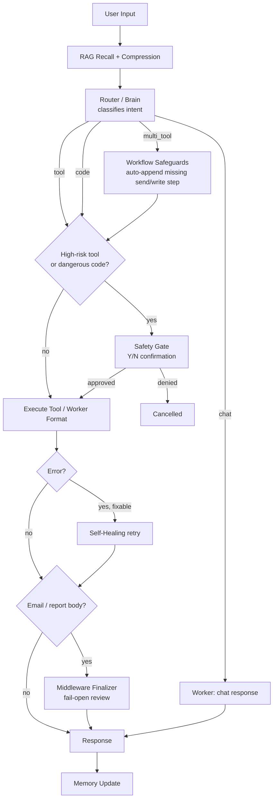

<p align="center">
  <b>🛰️ CIEL 2.0</b>
</p>

<h1 align="center">Ciel 2.0</h1>

<p align="center">
  An autonomous AI assistant built on a three-tier Brain → Worker → Middleware pipeline —
  routes intent, executes real tools, and self-audits its own output before it ever reaches you or your inbox.
</p>

<p align="center">
  <a href="architect.md">Architecture</a> ·
  <a href="note.txt">Live Status</a> ·
  <a href="ui/README.md">UI</a> ·
  <a href="autonomous_pipeline/architect.md">MLOps Pipeline</a>
</p>

<p align="center">
  <em>Internal research / experimental project — see <a href="#license--notes">License / Notes</a> before pointing this at production data.</em>
</p>

---

## What this is

Ciel is a personal AI agent that does more than answer questions — it routes your request to the right internal logic, executes real tools (filesystem, shell, email, trading data, web search, git, screen control), and checks its own work before responding. It is not a single LLM call wrapped in a chat UI; it's a pipeline with three distinct model roles and a safety layer that is intentionally decoupled from content filtering.

The **core** is the Brain → Worker → Middleware loop in `core/` — that's the part every request goes through, and it's the part you should understand first. The **tool packs** in `skills/` are the extension surface: adding a new capability means writing one tool file, not touching the routing logic. The **UI** (`ui/`) and **autonomous pipeline** (`autonomous_pipeline/`) are optional layers on top — a desktop/browser frontend and a self-training MLOps daemon, respectively. Neither is required to run Ciel from the CLI.



Every box above is a real module, not an aspiration — `core/router.py` (Router), `agent_system/models/worker.py` (Worker), `core/middleware.py` (Middleware), `core/recovery_manager.py` (Self-Healing). See [architect.md](architect.md) for the file-by-file breakdown.

---

## Prerequisites

| Requirement | Needed for | Notes |
|---|---|---|
| **Python 3.10+** | Core backend | Tested against the `myenv` virtualenv checked into this repo's tooling; use your own venv on a fresh clone. |
| **pip** | Dependency install | `pip install -r requirements.txt` |
| **At least one LLM provider API key** | Brain / Worker / Middleware | Gemini, DeepSeek, and/or Vilao. Ollama works fully offline if you'd rather not use a cloud key. |
| **Node.js 18+ and npm** | UI only | Only needed if you run `ui/`. Skip entirely for CLI-only use. |
| **Rust + MSVC C++ Build Tools** | Desktop (Tauri) build only | Only needed for `npm run tauri dev/build`. WebView2 ships with Windows 11 already. |
| **Google OAuth credentials** | Gmail tools | `credentials.json` + token — only needed if you use `search_gmail`/`send_gmail_message`/etc. |
| **TwelveData / Telegram tokens** | Trading tools, proactive digest | Optional; those tool packs degrade gracefully without them. |

> **Note on `torch`/RAG:** long-term memory (ChromaDB + `sentence-transformers`) needs a working PyTorch install. On some VPS environments PyTorch's `c10.dll` fails to initialize (missing VC++ Redistributable, or a CPU without AVX). Ciel detects this and disables RAG gracefully rather than crashing — you lose long-term memory, not the whole system.

---

## Quick Start

### 1. Clone and install

**Bash / Zsh**
```bash
git clone <your-repo-url> ciel-2.0
cd ciel-2.0
python -m venv myenv
source myenv/bin/activate
pip install -r requirements.txt
```

**PowerShell**
```powershell
git clone <your-repo-url> ciel-2.0
cd ciel-2.0
python -m venv myenv
myenv\Scripts\Activate.ps1
pip install -r requirements.txt
```

### 2. Configure `.env`

Create a `.env` file in the repo root (no example is checked in — build it from the keys below):

```dotenv
# --- Providers (mix and match per tier) ---
BRAIN_PROVIDER=vilao          # vilao | deepseek | gemini | ollama
BRAIN_MODEL=alic/qwen3.7-max
WORKER_PROVIDER=deepseek
CODER_MODEL=deepseek-chat     # NOT "WORKER_MODEL" — see gotcha below
GEMINI_API_KEY=...
DEEPSEEK_API_KEY=...
VILAO_API_KEY=...

# --- Safety (two INDEPENDENT flags — do not couple them) ---
SAFETY_OPEN=true              # relaxes Brain CONTENT filtering only
VILAO_SAFETY_BYPASS=true
DISABLE_SAFETY_GATE=false     # keeps the destructive-tool Y/N gate ACTIVE (recommended default)

# --- Optional tiers / integrations ---
MIDDLEWARE_ENABLED=true
TWELVEDATA_API_KEY=...
TELEGRAM_BOT_TOKEN=...
TELEGRAM_CHAT_ID=...
```

> **Gotcha:** `agent_system/config.py` reads the Worker model from `CODER_MODEL`, not `WORKER_MODEL`. A `.env` entry literally named `WORKER_MODEL` is silently ignored.

### 3. Run the CLI

**Bash / Zsh**
```bash
python main.py
```

**PowerShell**
```powershell
python main.py
```

Type a request at the `Master:` prompt. High-risk actions (file delete, shell exec, sending email, etc.) will ask for a `Y/N` confirmation unless `DISABLE_SAFETY_GATE=true`.

### 4. (Optional) Run the API server + UI

**Bash / Zsh**
```bash
python main_api.py &          # backend: ws://localhost:8000/ws, GET /skills, /health
cd ui && npm install && npm run dev   # browser UI: http://localhost:1420
```

**PowerShell**
```powershell
Start-Process python main_api.py
cd ui; npm install; npm run dev
```

For the wrapped desktop app instead of the browser tab: `cd ui && npm run tauri dev` (requires the backend running separately — see [ui/README.md](ui/README.md)).

---

## Main Features

**Routing & Execution**
- **Three-Tier Architecture** — Brain (intent routing/planning) → Worker (content/code generation) → Middleware (scoped finalizer for email/report bodies, fail-open by design).
- **Deterministic Workflow Safeguards** — if a plan is missing its terminal send step (email intent + address) or write step (explicit path + write verb), it's auto-appended in code, not left to the Brain to remember.
- **Self-Healing with a Skip-List** — multi-attempt autonomous recovery for tool/code errors, but skips error classes no retry can ever fix (missing library, network timeout, geo-restriction) instead of burning a guaranteed-to-fail Worker call.

**Safety**
- **Decoupled Safety Model** — content-filter permissiveness (`SAFETY_OPEN`) and the destructive-action confirmation gate (`DISABLE_SAFETY_GATE`) are independent flags on purpose; a denied confirmation can never be silently overridden by the content-filter setting.
- **Dangerous-Code Gate** — any Worker-written script or file (not just the 8 known high-risk tools) is scanned for destructive patterns — drive format, `shutil.rmtree`, fork bombs — and gated behind the same Y/N confirmation.

**Memory & Data**
- **Hybrid RAG Memory** — short-term chat history plus long-term ChromaDB semantic memory, with two-tier compression to keep recalled context cheap.
- **Email Send Pipeline** — market/asset reports, research/news digests, and document summaries each gather real tool data *first*, then compose; anti-fabrication rules block invented prices and hollow "attached" shells.

**Ops**
- **Cost/Usage Tracking** — every real LLM call across all three tiers logs to one chokepoint (`[LLM_CALL] model=...`); live vitals and test dashboards report real per-tier counts, not estimates.
- **Autonomous MLOps Pipeline** (`autonomous_pipeline/`) — a background daemon that simulates a Master, runs real Ciel tasks, audits them with an independent Judge model, and grows a Worker fine-tuning dataset — including a Chaos Injector that manufactures hard edge cases (timeouts, missing files, API errors) the normal loop never generates on its own.

**Interface**
- **Desktop/Browser UI** — React + Tauri v2, browser-first and desktop-wrappable with zero code changes between the two. The skill list and live activity feed are 100% backend-driven.
- **Vision & Screen Control** — PyAutoGUI + Gemini Vision for direct UI interaction when no API/tool exists for a task.
- **Multi-Provider** — Brain, Worker, and Middleware can each run a different provider (Vilao, DeepSeek, Gemini, Ollama), swappable via `.env` with no code changes.

---

## How It Works

1. **User input arrives** at `CielCore.process()` (`core/llm_connector.py`), either from the CLI loop, the WebSocket API, or the autonomous pipeline's task generator.
2. **RAG recall** searches ChromaDB for semantically relevant past context and injects a compressed summary into the prompt — skipped for short/low-relevance queries to avoid noise.
3. **The Router (Brain)** classifies intent into `chat`, `tool`, `code`, or `multi_tool` and returns a structured plan.
4. **Workflow safeguards** run before execution: if the plan implies a send or write action but the corresponding step is missing, it's appended deterministically.
5. **The Safety Gate** intercepts high-risk tool calls and any code/file write matching a dangerous pattern, blocking until the user approves (unless the gate is disabled for unattended flows).
6. **Execution** happens via `ToolManager` — real API calls, real file writes, real shell commands. Errors trigger **Self-Healing**, which retries with an escalating strategy but skips error classes it knows it can't fix.
7. **The Worker** formats the raw tool result into the final response, always instructed to report only what the tool actually returned — never to invent data.
8. **Middleware** (if enabled) reviews outbound email/report bodies specifically, catching topic mismatches and internal contradictions a regex sanitizer can't — and edits the body in place rather than blocking, failing open on any error.
9. **The response returns** to the user and the exchange is saved to memory, with overflow archived into the long-term vector store.

### What makes this different

Most agent frameworks treat "the LLM decided to do X" as sufficient. Ciel treats the LLM's decision as a *proposal* that gets checked at multiple points: a workflow safeguard verifies the plan is actually complete, a safety gate verifies risky actions are approved, a self-healing skip-list verifies retries aren't wasted on unfixable errors, and a Middleware tier verifies the final output doesn't contradict itself — all *before* anything is written to disk or sent to a real inbox. None of these checks are another LLM call pretending to be certain; most are deterministic code, and the one LLM-based check (Middleware) is scoped narrowly and fails open specifically so it can never become the single point of failure for a send.

---

## File Structure

```text
Ciel 2.0/
├── main.py                  # CLI entry point
├── main_api.py               # FastAPI + WebSocket server for the UI
├── architect.md              # Full architecture map (start here for deep dives)
├── note.txt                  # Live status / rolling changelog
├── requirements.txt
│
├── core/                     # Main orchestration — the part every request goes through
│   ├── llm_connector.py      # CielCore: routes → executes → responds
│   ├── router.py              # Brain-based intent classification
│   ├── middleware.py          # Email/report finalizer (Tier 3)
│   ├── recovery_manager.py    # Self-healing with skip-list
│   ├── rag_manager.py         # ChromaDB long-term memory
│   ├── scheduler.py           # Proactive background tasks (e.g. daily digest)
│   └── tool_manager.py        # Tool registry & execution
│
├── agent_system/              # Brain/Worker LLM models + LangGraph pipeline
│   ├── models/brain.py
│   ├── models/worker.py
│   └── graph/                 # Multi-step structured code-gen pipeline
│
├── skills/                    # Tool packs — the extension surface
│   ├── internal/               # filesystem, OS/shell, vision
│   └── external/                # Gmail, trading, Telegram, GitHub, web search, documents
│
├── ui/                         # React + Tauri v2 frontend (optional)
│   └── README.md                # UI-specific setup and architecture
│
├── autonomous_pipeline/        # Self-running MLOps daemon (optional)
│   ├── orchestrator.py          # Background scheduler
│   ├── task_generator.py        # Simulated Master
│   ├── data_pipeline.py         # Judge audit + dataset builder
│   ├── chaos_injector.py        # Adversarial edge-case injection
│   └── architect.md              # Pipeline-specific architecture map
│
├── email_template/             # Structured templates for outbound email bodies
├── backtest/                   # Integration/stress tests + prompt_harness.py
├── instructionAI/              # AI-assistant instruction files (start with SKILL.md)
├── ciel_workspace/              # Sandbox for user files, logs, screenshots
└── agent_output/                # Default output location for AI-generated code
```

---

## Customization

| I want to... | Edit this |
|---|---|
| Change Ciel's persona / tone | `persona/` (`identity.txt`, `directives.txt`, `format.txt`) |
| Add a new tool/capability | New file under `skills/internal/` or `skills/external/`, registered in `core/tool_manager.py` — the UI's skill grid updates automatically, no frontend changes needed |
| Switch LLM providers | `.env` — `BRAIN_PROVIDER`, `WORKER_PROVIDER`, plus each provider's model name (`BRAIN_MODEL`, `CODER_MODEL`) |
| Add/remove a high-risk tool from the safety gate | `core/llm_connector.py` — `_HIGH_RISK_TOOLS` / `_RISK_DESCRIPTIONS` |
| Tune what counts as "dangerous code" | `core/llm_connector.py` — `_find_dangerous_code_patterns()` |
| Change an email template's structure | `note.txt` (templates section) and `email_template/` |
| Adjust RAG recall sensitivity | `core/rag_manager.py` — `MIN_QUERY_LENGTH`, `MIN_RELEVANCE_SCORE` |
| Enable/scope the Middleware tier | `.env` — `MIDDLEWARE_ENABLED`, `MIDDLEWARE_SCOPE`, `MIDDLEWARE_MAX_PASSES` |
| Change the autonomous pipeline's task cadence | `autonomous_pipeline/orchestrator.py` |
| Add a UI-side voice input/output modality | `ui/src/io/input/VoiceInput.tsx` or `ui/src/io/output/` — see [ui/README.md](ui/README.md) for the two design rules that make this a small change |

---

## Tips for Better Results

**Keep the safety gate on unless you mean it.** `DISABLE_SAFETY_GATE=true` is meant for the autonomous pipeline and other fully unattended flows — not for everyday CLI use. The two safety flags are separate precisely so you can loosen content filtering without also losing the destructive-action confirmation.

**Give tasks explicit output specs.** Both the live Router and the autonomous pipeline's task generator produce noticeably better (less hallucinated) results when the request states *what* to output, not just *what to do* — e.g. "report only the closing price value" beats "get me the BTC price."

**Watch `thoughts.log`, not just the console.** `ciel_data/logs/thoughts.log` is the full raw audit trail (RAG recalls, route decisions, tool results, healing attempts, Middleware reviews). `scripts/format_thoughts_log.py` renders it into a readable Markdown view when debugging a specific turn.

**Don't skip the RAG dependency check on a VPS.** If you see `[WinError 1114] ... c10.dll` on boot, that's PyTorch failing to initialize (usually a missing VC++ Redistributable or a CPU without AVX) — not a code bug. Ciel disables RAG gracefully and keeps running; install the redistributable or pin an older `torch` build if you need long-term memory on that machine.

**Run `prompt_harness.py` before hand-editing a prompt.** `python -m scripts.prompt_harness --min-count 3` mines `thoughts.log` for recurring failure patterns and tells you which file/prompt is actually worth patching, instead of guessing from a handful of anecdotal bad responses.

---

## Contributing

This is currently an internal/experimental project without a formal contribution process. If you fork it: keep the safety-flag separation intact, prefer deterministic checks over trusting the Brain to "remember" a rule, and read `architect.md`'s Changelog section before touching `core/llm_connector.py` — most of its logic exists because of a specific, previously-observed failure.

## Acknowledgements

Built on [LangChain](https://github.com/langchain-ai/langchain) / [LangGraph](https://github.com/langchain-ai/langgraph), [ChromaDB](https://github.com/chroma-core/chroma), [sentence-transformers](https://github.com/UKPLab/sentence-transformers), [FastAPI](https://github.com/tiangolo/fastapi), and [Tauri](https://github.com/tauri-apps/tauri) — with Gemini, DeepSeek, and Vilao as the LLM providers exercised in production.

## License / Notes

No formal license is attached — this is an internal research/experimental project. Use at your own risk: the safety mechanisms are configurable, and the AI can perform real, powerful actions (sending email, running shell commands, writing/deleting files) when gates are open. Review `core/llm_connector.py`'s safety-gate logic before pointing this at any account or machine you care about.

For detailed architecture and instructions aimed specifically at AI assistants working on this codebase, see [instructionAI/](instructionAI/) (start with `SKILL.md`).
