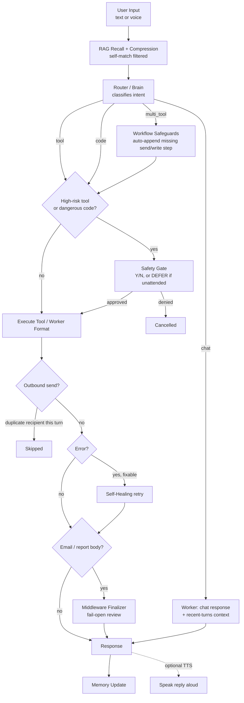

<p align="center">
  <b>🛰️ CIEL 2.0</b>
</p>

<h1 align="center">Ciel 2.0</h1>

<p align="center">
  An autonomous AI assistant built on a <b>Brain → Router → Middleware → Worker</b> pipeline,
  extended by seven agent-capability tiers that close the gap between
  <em>executing commands</em> and <em>pursuing goals</em>.
</p>

<p align="center">
  <a href="architect.md">Architecture</a> ·
  <a href="note.md">Live Status</a> ·
  <a href="PROMPT_INVENTORY.md">Prompts</a> ·
  <a href="ui/README.md">UI</a> ·
  <a href="autonomous_pipeline/architect.md">MLOps Pipeline</a>
</p>

<p align="center">
  <em>Internal research / experimental project — see <a href="#license--notes">License / Notes</a> before pointing this at production data.</em>
</p>

---

## Table of Contents

- [What this is](#what-this-is)
- [Prerequisites](#prerequisites)
- [Quick Start](#quick-start)
- [Feature Overview](#feature-overview)
- [How It Works](#how-it-works)
- [Voice I/O](#voice-io)
- [Observability & Cost](#observability--cost)
- [Backend API](#backend-api)
- [Docker Deployment](#docker-deployment)
- [Rebuilding the UI](#rebuilding-the-ui)
- [File Structure](#file-structure)
- [Customization](#customization)
- [Tips for Better Results](#tips-for-better-results)
- [Contributing](#contributing)
- [License / Notes](#license--notes)

---

## What this is

Ciel is a personal AI agent that does more than answer questions — it routes your
request to the right internal logic, executes **real tools** (filesystem, shell,
email, trading data, web search, git, screen control), and checks its own work before
responding. It is not a single LLM call wrapped in a chat UI; it's a pipeline with
distinct model roles and a safety layer intentionally decoupled from content
filtering.

Three layers, in order of importance:

- **The core** — the `Brain → Router → Middleware → Worker` loop in `core/`. Every
  request goes through it, and it's the part to understand first.
- **The tool packs** — `skills/`, the extension surface. Adding a capability means
  writing one tool file, not touching routing.
- **The optional layers** — a desktop/browser **UI** (`ui/`), a self-training **MLOps
  pipeline** (`autonomous_pipeline/`), and **voice I/O**. None are required to run Ciel
  from the CLI.

On top of that core sit **seven agent-capability tiers**:

| # | Tier | Closes the gap where… |
|---|---|---|
| 1 | Agent loop | a flat plan can't express "if X then Y" |
| 2 | Task state | interrupted work used to vanish without a trace |
| 3 | Permissions | approval was binary and arrived mid-execution |
| 4 | Context discipline | prompt assembly had no budget and no audit trail |
| 5 | Interruptibility | a long request could only be stopped by killing the process |
| 6 | Proactivity | Ciel could only ever answer, never speak first |
| 7 | A model of you | memory retrieved passages but never accumulated understanding |

One rule runs through all seven: **the decision is deterministic Python; the model
only plans or composes.** That is what makes them survive a change — or a downgrade —
of model. Each tier is a separate `core/` module and each can be switched off in
`.env`, degrading to the pre-tier behaviour rather than breaking. See
[`instructionAI/architecture.md`](instructionAI/architecture.md) for the full detail on
each one, including three bugs found by reading real transcripts (not test failures)
and fixed this cycle.



Every box above is a real module — `core/router.py`, `agent_system/models/worker.py`,
`core/middleware.py`, `core/recovery_manager.py`. See
[instructionAI/architecture.md](instructionAI/architecture.md) for the file-by-file
breakdown.

---

## Prerequisites

| Requirement | Needed for | Notes |
|---|---|---|
| **Python 3.12+** | Core backend | `pandas-ta` requires Python >=3.12 with no PyPI distribution for older versions. Use a fresh virtualenv on a new clone. |
| **pip** | Dependency install | `pip install -r requirements.txt` |
| **At least one LLM provider API key** | Brain / Worker / Middleware | Any OpenAI-compatible endpoint via `custom` (`API_KEY`+`BASE_URL`), or Gemini/DeepSeek/Vilao directly. Ollama works fully offline. |
| **Node.js 18+ and npm** | UI only | Only needed if you run `ui/`. Skip for CLI-only use. |
| **Rust + MSVC C++ Build Tools** | Desktop (Tauri) build only | Only for `npm run tauri dev/build`. WebView2 ships with Windows 11 already. |
| **Google OAuth credentials** | Gmail tools | `credentials.json` + token. Missing it disables *only* Gmail tools. |
| **Microphone + internet** | Voice I/O only | Default STT/TTS backends are free and need no key, but do need a network connection. |
| **TwelveData / Telegram tokens** | Trading tools, proactive digest, Telegram bot front-end | Optional for trading/digest (degrades gracefully). Required for `main_telegram.py`: `TELEGRAM_BOT_TOKEN` + a real numeric `TELEGRAM_CHAT_ID` (not any of your other API keys). |
| **Docker** | Container deployment only | Only needed for `docker/` — see [Docker Deployment](#docker-deployment). Skip for a bare CLI/UI run. |

> **Note on `torch`/RAG:** long-term memory (ChromaDB + `sentence-transformers`) needs a
> working PyTorch install. If `c10.dll` fails to initialize (missing VC++
> Redistributable, or a CPU without AVX), Ciel disables RAG gracefully rather than
> crashing — you lose long-term memory, not the whole system.

---

## Quick Start

### 1. Clone and install

**Bash / Zsh**
```bash
git clone <your-repo-url> ciel-2.0
cd ciel-2.0
python -m venv myenv
source myenv/bin/activate
pip install -r requirements.txt
```

**PowerShell**
```powershell
git clone <your-repo-url> ciel-2.0
cd ciel-2.0
python -m venv myenv
myenv\Scripts\Activate.ps1
pip install -r requirements.txt
```

### 2. Configure `.env`

Create a `.env` file in the repo root (no example is checked in — build it from the
keys below). This is the **minimum to run** — every one of the seven agent-capability
tiers (loop, task state, permissions, context budget, cancellation, proactivity, user
model) defaults **off** or to safe pre-tier behaviour, so nothing below is required
beyond providers and safety. Every tier's own knobs are in the
[Customization](#customization) table, not duplicated here.

```dotenv
# --- Providers ---
# One custom OpenAI-compatible endpoint powers all three tiers below by default —
# swapping providers later is a 2-variable edit (API_KEY + BASE_URL) plus whichever
# *_MODEL names change, no code change needed. See agent_system/config.py's note.
BRAIN_PROVIDER=custom          # custom | vilao | deepseek | gemini | ollama
BRAIN_MODEL=gpt-5.6-sol
WORKER_PROVIDER=custom
CODER_MODEL=gpt-5.6-luna      # NOT "WORKER_MODEL" — see gotcha below
MIDDLEWARE_PROVIDER=custom
MIDDLEWARE_MODEL=gpt-5.5
API_KEY=...                    # your OpenAI-compatible endpoint's key
BASE_URL=https://your-provider.example/v1
# Only needed if a tier uses one of the OTHER providers instead of "custom":
GEMINI_API_KEY=...
DEEPSEEK_API_KEY=...
VILAO_API_KEY=...

# --- Safety (two INDEPENDENT flags — do not couple them) ---
SAFETY_OPEN=true              # relaxes Brain CONTENT filtering only
VILAO_SAFETY_BYPASS=true
DISABLE_SAFETY_GATE=false     # keeps the destructive-tool Y/N gate ACTIVE (recommended default)

# --- Optional integrations (each degrades gracefully if left blank) ---
MIDDLEWARE_ENABLED=true
TWELVEDATA_API_KEY=...
TELEGRAM_BOT_TOKEN=...
TELEGRAM_CHAT_ID=...           # numeric — message @userinfobot to find yours, not another key
DISABLED_SKILL_MODULES=       # e.g. vision_ops — skip a whole skill module at load (Docker)
# Real Google results for stealth_search, via SerpApi. WITHOUT this, search still works
# but silently drops to the weaker DuckDuckGo/News-RSS tier — it never errors, so a
# missing key looks exactly like a working one. API_ENDPOINT has a code default.
SEARCH_API_KEY=...
API_ENDPOINT=https://serpapi.com/search?engine=google
```

> **Gotcha:** `agent_system/config.py` reads the Worker model from `CODER_MODEL`, not
> `WORKER_MODEL`. A `.env` entry literally named `WORKER_MODEL` is silently ignored.

Everything else — the Tier-1 agent loop, parallel execution, Tier-4 context budgets,
Tier-6 proactivity (9 triggers), Tier-7 user model, permissions lists, the email-bypass
escape hatch, voice I/O backends — has its own `.env` knob(s), all off or safely
defaulted until you opt in. Full list: the [Customization](#customization) table below,
or grep `agent_system/config.py` for every `os.getenv(...)` call.

### 3. Run the CLI

```bash
python main.py
```

Type a request at the `Master:` prompt. High-risk actions (file delete, shell exec,
sending email, etc.) ask for a `Y/N` confirmation unless `DISABLE_SAFETY_GATE=true`.
Ctrl+C during a request cancels **that request** (Tier 5); Ctrl+C at the prompt exits.

**Talk to it (optional):**
```bash
python main.py --voice --speak     # speak requests, hear replies
```
- `--voice`: press Enter on an empty line to speak, or type to override; `:v` does a
  one-off voice capture in any mode.
- `--speak`: Ciel reads each reply aloud (the printed transcript is unchanged).
- Test each modality standalone first: `python -m core.voice_input` (mic → text) and
  `python -m core.speech_output "Xin chào Master"` (text → speech).

### 4. (Optional) Run the API server + UI

**Bash / Zsh**
```bash
python main_api.py &                    # backend: ws://localhost:8000/ws + REST
cd ui && npm install && npm run dev     # browser UI: http://localhost:1420
```

**PowerShell**
```powershell
Start-Process python main_api.py
cd ui; npm install; npm run dev
```

Click the 🔇 → 🔊 button beside the input box to have Ciel read replies aloud (same
neural voice as the CLI). For the wrapped desktop app instead of the browser tab:
`cd ui && npm run tauri dev` — see [ui/README.md](ui/README.md).

### 5. (Optional) Run as a Telegram bot

A third front-end, independent of the CLI/UI — same core underneath. Requires
`TELEGRAM_BOT_TOKEN` and a real numeric `TELEGRAM_CHAT_ID` in `.env` (message
`@userinfobot` on Telegram, or hit `getUpdates` after messaging your own bot, to find
it — it's a number, not any of your other API keys).

```bash
python main_telegram.py
```

Every message is checked against `TELEGRAM_CHAT_ID` before it reaches Ciel — anyone
else messaging the bot is ignored. High-risk actions arrive as an inline Yes/No
keyboard instead of a CLI prompt; `/cancel` interrupts whatever is currently running
(Tier 5). Don't run this alongside `main_api.py`/`main.py` against the same `ciel_data/`
at the same time (see the Docker section below) — pick one front-end at a time until
that's addressed.

### 6. (Optional) Run in Docker

```bash
docker compose -f docker/docker-compose.api.yml up -d --build        # main_api.py, Vercel-facing
docker compose -f docker/docker-compose.telegram.yml up -d --build   # main_telegram.py
```

Same image, split into separate compose files so either can be built/started/stopped
independently. Full details — required host files, the shared-`ciel_data/` caveat, why
not to run both at once yet: [docker/README.md](docker/README.md).

---

## Feature Overview

### Routing & Execution
- **Brain → Router → Middleware → Worker** — intent routing/planning, a scoped
  fail-open finalizer for email/report bodies, and content/code generation, each an
  independently configurable LLM tier.
- **Four intent types** — every turn is classified as `chat`, `tool`, `code`, or
  `multi_tool`. For `chat`, the router's own draft `task` is treated as a hint only —
  the Worker always sees the Master's real words, so a strong Brain pre-writing the
  final reply (once caught doing exactly that, in the wrong language) can never
  silently override how or in what language the answer comes out.
- **Agent loop — observe, re-plan, act** (Tier 1, `core/continuation.py`) — closes the
  gap where a flat plan can't express "check git status, and if it's clean, commit".
  Five deterministic signals decide whether another round is warranted; a sixth,
  higher-priority check — an explicit "chỉ … thôi" / "only …" — vetoes all of them, so
  the loop never does work a human explicitly bounded against. Zero extra tokens on an
  ordinary request; every ceiling (rounds, calls, wall-clock) enforced in code.
- **Parallel tool execution** (`core/parallel.py`) — provably independent steps in one
  plan run concurrently. Opt-in per tool, since auto-registration means a blacklist
  would silently parallelise a newly added mutating tool. 9.3× measured on file
  fan-out.
- **Durable task state** (Tier 2, `core/task_state.py`) — an interrupted job leaves a
  resumable record instead of vanishing. `đang làm gì` / `status` answers from it —
  **0 LLM calls, ~0.1s**.
- **Bounded, auditable context** (Tier 4, `core/context.py`) — one assembler with a
  token budget and a log line, replacing scattered string concatenation. Blocks drop
  **whole, never truncated**. RAG recall is bounded at its source and filtered against
  recalling its own prior failure on a repeated question.
- **Recent-turn memory for replies** — the last few turns are injected into the
  response path (never routing), fixing a real gap where a follow-up like "tại sao lại
  thế" got answered with no memory of the turn just completed.
- **Interruptible requests** (Tier 5) — Ctrl+C or the UI's Stop button cancels the
  in-flight request at the next **step boundary**, never mid-tool. The job closes as
  `cancelled`, distinguishable from a crash.
- **Deterministic Workflow Safeguards** — a plan missing its terminal send/write step
  gets one appended in code, not left to the Brain to remember. Enforces an explicit
  subject and blocks any unsynthesized placeholder from reaching a file or inbox.
- **One delivery per recipient per turn** — two independent mechanisms used to
  complete a plan's missing send step and could both fire, delivering the same report
  twice with different subjects. Now deduped by recipient at the single choke point
  every send passes through.
- **Dependent multi-tool steps** — `{{prev}}`/`{{step_N}}` substituted deterministically
  at run time (no LLM).
- **Self-Healing with a Skip-List** — skips error classes no retry can ever fix instead
  of burning a guaranteed-to-fail Worker call.
- **Memory-aware recall fallback** — an inspection tool that comes back empty falls
  back to recalled long-term context, labeled "unverified from workspace".
- **Dated, sourced web search** — `stealth_search` hits **real Google** via SerpApi
  first (the same index a human searching gets), falling back to Google News RSS then
  DuckDuckGo if no key is set or the call fails; every hit carries a real publication
  date and outlet, the requested time window is enforced on that real date rather than
  trusted, and the query is built in **your** language.
- **It looks things up before saying "I don't know"** — when a reply concedes a
  knowledge gap, a deterministic Python gate searches the web and re-answers from the
  results. Costs nothing on an ordinary turn (the gate only fires on an actual
  admission), skips questions about your own stored data, and keeps the honest "I
  couldn't find it" rather than inventing an answer when the search comes back empty.

### Proactivity & Personalisation
- **Ciel speaks first** (Tier 6, `core/notifier.py` + `core/triggers.py`) — nine
  condition triggers in three groups: watching itself (an abandoned job, a cost spike,
  a repeatedly failing tool, actions awaiting approval), the clock, and the outside
  world behind thresholds you set. Every check is plain Python over data already on
  disk — **an idle Ciel costs zero tokens**. Off by default, opt-in per trigger by name.
- **Anti-noise, enforced in code, not requested in a prompt** — a notification with no
  concrete action cannot interrupt; identity comes from the *thing* so a standing
  condition is announced once; delivery routes by **liveness**, since a running process
  is not a present human; a daily budget caps interruptions; a finding you keep
  ignoring goes quiet after N repeats.
- **Silence is never consent** — a trigger firing at 03:00 has nobody to ask, so risky
  tools resolve to **`DEFER`**: recorded and raised at your next interaction, never
  auto-approved. Session grants, plan approvals, even `DISABLE_SAFETY_GATE` are
  ignored in that context. Deferred actions are **never replayed** automatically.
- **A model of you** (Tier 7, `core/user_model.py`) — a bounded profile injected only
  where a preference actually changes the output. What you **said** outranks what
  Ciel **inferred**; non-stated traits **decay**; a **hard token ceiling** means it
  costs literally zero until it has learned something.
- **It learns without being told to remember** — a free deterministic gate skips
  one-off wording outright; only explicit durable wording buys a single extraction
  call, on a background thread, so an ordinary turn costs nothing and the reply is
  never delayed.
- **Credentials can never enter the injected store** — `facts.json` stays pull-only;
  `user_model.json` is injected and deterministically refuses anything that looks like
  a credential. The profile is human-readable and editable on purpose; `forget()`
  really deletes.

### Safety
- **Decoupled Safety Model** — content-filter permissiveness and the destructive-action
  confirmation gate are independent flags on purpose.
- **Three/four-way permissions** (`core/permissions.py`) — every `(tool, args)`
  resolves to `AUTO`, `ASK`, `DENY`, or (unattended) `DEFER`.
- **Approve the plan, not the fragments** — a multi-step plan raises **one** prompt
  covering every step needing approval, before the first step runs. Approvals are
  scoped to the exact `(tool + args)` reviewed.
- **Session grants** — answer `A` at a CLI prompt to stop being asked about that one
  tool for the rest of the run. In-memory only, refused for deny-listed tools.
- **High-Risk Tool Gate** — eight tools that touch the outside world require an
  explicit `Y/N`, plus a content-based gate for destructive patterns in
  generated code/writes.
- **Confirmations survive a restart** — a preview tool declares its own follow-up; a
  later bare "yes" executes it with zero LLM calls, persisted so a process death
  doesn't lose it.
- **Sandboxed Filesystem** — file tools are quarantined to `ciel_workspace/` /
  `agent_output/`.

### Memory & Data
- **Hybrid RAG Memory** — short-term chat history plus long-term ChromaDB semantic
  memory, filtered against recalling a question's own prior failure as "context".
- **Two memory stores, split by security boundary** — `facts.json` (pull-only, may
  hold secrets, never injected) vs. `user_model.json` (injected, refuses secrets).
- **Email Send Pipeline** — market/asset reports, research digests, and document
  summaries gather real tool data first, then compose; anti-fabrication rules block
  invented prices and hollow "attached" shells.

### Voice I/O
- **Speech-to-Text (CLI)** — `core/voice_input.py` captures the mic and transcribes,
  feeding the exact same pipeline the keyboard uses.
- **Text-to-Speech (CLI + UI)** — free neural voices (Vietnamese by default); a
  deterministic normalizer strips markdown/emojis/tags without touching the persona.
- **Swappable backends** — selected via `.env`; defaults are free, no API key needed.

### Observability & Cost
- **Full Audit Trail** — every RAG recall, route decision, tool result, healing
  attempt, and Middleware review logged to `ciel_data/logs/thoughts.log`.
- **Token-Precise Cost Tracking** — exact provider token counts per call; live vitals
  show per-tier tokens and estimated USD; `scripts/cost_report.py` aggregates over time.

### Interface
- **Desktop/Browser UI** — React + Tauri v2, browser-first and desktop-wrappable with
  zero code changes between the two. Skills panel (left, 100% backend-driven) and a
  chat workbench (right) with a stop button, safety-gate dialog, and live vitals.
- **Telegram bot** (`main_telegram.py`) — a third front-end onto the same core, chat_id
  allow-listed, with an inline-keyboard safety confirmation dialog and `/cancel`. Accepts
  photos/documents too — downloaded into the sandbox and handed to Ciel as a normal
  message, routed like anything else (`read_document` for a file, `describe_image_file`
  for a photo — never a forced/hardcoded tool call).
- **Vision & Screen Control** — PyAutoGUI + Gemini Vision for direct UI interaction
  when no API/tool exists for a task, plus `describe_image_file` for looking at an
  existing image FILE (not the live screen) — e.g. one just uploaded via Telegram.
  Skippable per-deployment via `.env`'s `DISABLED_SKILL_MODULES=vision_ops` — e.g. a
  headless server has no display for it (this also skips `describe_image_file`, which
  doesn't strictly need one — a known trade-off, not a bug).
- **Multi-Provider** — Brain, Worker, and Middleware can each run a different provider,
  swappable via `.env` with no code changes.

### Autonomy
- **Autonomous MLOps Pipeline** (`autonomous_pipeline/`) — a background daemon that
  simulates a Master, runs real Ciel tasks, audits them with an independent Judge
  model, and grows a Worker fine-tuning dataset, including a Chaos Injector for hard
  edge cases the normal loop never generates.
- **Proactive Scheduler** — zero-token standby background tasks that call tools
  directly and never pollute conversational memory.

---

## How It Works

1. **User input arrives** at `CielCore.process()` (`core/llm_connector.py`) — from the
   CLI loop, the WebSocket API, a voice transcript, or the autonomous pipeline.
2. **RAG recall** searches ChromaDB for relevant past context, filters out a result
   that is just the current question recalling its own prior failure, and injects a
   compressed summary — skipped for short/low-relevance queries.
3. **The Router (Brain)** classifies intent into `chat`, `tool`, `code`, or
   `multi_tool` and returns a structured plan. For `chat`, its own `task` field is
   never handed to the Worker as the request — only as a labelled hint.
4. **Workflow safeguards** run before execution: a missing send/write step is appended
   deterministically.
5. **The Safety Gate** intercepts high-risk calls and dangerous-pattern writes,
   blocking until approved — or, if nobody is present, deferring rather than assuming
   consent.
6. **Execution** happens via `ToolManager`. Errors trigger **Self-Healing**, which
   retries with an escalating strategy but skips error classes it knows it can't fix.
   An outbound send is deduped against this turn's earlier sends by recipient.
7. **The Worker** formats the raw tool result into the final response — with recent
   conversation turns in view — always instructed to report only what the tool
   actually returned.
8. **Middleware** (if enabled) reviews outbound email/report bodies, catching
   mismatches a regex sanitizer can't, editing in place and failing open on any error.
9. **The response returns**, optionally spoken aloud, saved to memory with overflow
   archived into the vector store, and the Tier-2 task record closes.

### What makes this different

Most agent frameworks treat "the LLM decided to do X" as sufficient. Ciel treats the
LLM's decision as a *proposal* checked at multiple points: a workflow safeguard
verifies the plan is complete, a safety gate verifies risky actions are approved (or
defers them when nobody is present to ask), a duplicate-send guard verifies a report
isn't mailed twice, a self-healing skip-list verifies retries aren't wasted on
unfixable errors, and a Middleware tier verifies the final output doesn't contradict
itself — all *before* anything is written to disk or sent to a real inbox. None of
these checks are another LLM call pretending to be certain; almost all are
deterministic code, and the one LLM-based check (Middleware) is scoped narrowly and
fails open specifically so it can never become the single point of failure for a send.

---

## Voice I/O

Voice is a modality layer, not a rewrite — a spoken sentence becomes text and flows
through the same `run_step()` the keyboard uses, and a reply is spoken *after* a
deterministic normalizer cleans it. The prompts and persona are never changed to be
"speech-friendly"; text, HUD, and email keep their rich formatting.

### Speech-to-Text (`core/voice_input.py`)

Mic capture uses `sounddevice`. Energy-based endpointing auto-calibrates ambient noise
and stops on silence.

| `STT_BACKEND` | Engine | Notes |
|---|---|---|
| `whisper` *(default)* | `faster-whisper`, local CPU | Offline, no key, good Vietnamese accuracy — chosen to avoid depending on a free cloud endpoint |
| `google` | SpeechRecognition → free Google Web Speech | No API key, supports vi-VN, needs internet |
| `gemini` | google-genai | Needs `GEMINI_API_KEY` |

### Text-to-Speech (`core/speech_output.py`)

`to_speech()` strips markdown, emojis, `[TAG]`-style headers, code blocks, and URLs
(numbers preserved) before synthesis.

| `TTS_BACKEND` | Engine | Notes |
|---|---|---|
| `edge` *(default)* | edge-tts (Microsoft neural voices) | Free, no key, vi-VN neural; unofficial endpoint — backoff retry handles sporadic failures |
| `pyttsx3` | Offline OS/SAPI voices | No internet; weaker Vietnamese |
| `space` / `rvc` | mikuTTS HF Space (RVC character voice) | Experimental; ~25s/utterance, may sleep — not a default |

Prosody knobs: `TTS_VOICE`, `TTS_RATE`, `TTS_PITCH`, `TTS_VOLUME`. RVC-only (only for
`TTS_BACKEND=space`): `RVC_MODEL`, `RVC_TTS_VOICE`, `RVC_F0_UP`, `RVC_F0_METHOD`,
`RVC_INDEX_RATE`, `RVC_PROTECT`, `RVC_SPACE`.

### In the UI

Voice **output** is wired end-to-end: the 🔊 toggle subscribes to the reply event,
POSTs the text to `POST /tts` (the same `to_speech()` + edge-tts as the CLI), and plays
the returned MP3. Voice **input** in the UI uses the browser's native Web Speech API —
a separate, intentional engine from the CLI's server-side STT.

> **GPU note:** none of the default voice backends use your local GPU — edge-tts and
> the RVC Space run on remote servers, `pyttsx3`/`faster-whisper` are light CPU
> workloads.

---

## Observability & Cost

Ciel is designed to be inspectable — you can always answer "what did it do and what
did it cost?"

- **`thoughts.log`** (`ciel_data/logs/thoughts.log`) — the full raw audit trail: RAG
  recalls, route decisions, tool results, healing attempts, Middleware reviews, and one
  `[LLM_CALL] model=<id> in=<n> out=<n> total=<n>` line per real model call.
  `scripts/format_thoughts_log.py` renders a readable view for a specific turn.
- **Live cost in vitals** — the API's vitals feed reports real per-tier call counts,
  exact token totals, and an estimated USD cost, live for the session. Prices live in
  `core/cost.py`, overridable via `ciel_data/model_pricing.json` with no code change.
- **Cumulative report** — `python -m scripts.cost_report [--since-days N] [--json]`
  aggregates usage and estimated spend by tier, model, and day.
- **Prompt harness** — `python -m scripts.prompt_harness --min-count 3` mines the log
  for recurring failure patterns and points at what's actually worth patching —
  deterministic, never auto-edits.

---

## Backend API

`python main_api.py` serves a FastAPI app (default `http://localhost:8000`). The UI
talks to it; you can too.

| Endpoint | Purpose |
|---|---|
| `WS /ws` | Main channel — chat messages, streamed thoughts, live vitals, `Y/N` safety confirmations, and cancellation. |
| `GET /health` | Liveness/readiness probe (`ready` flips true once the agent boots). |
| `GET /skills` | Dynamic manifest of loaded skill modules + tools — the UI renders its skill panels from this. |
| `POST /tts` | `{ "text": "..." }` → normalized edge-tts MP3 (`audio/mpeg`). `204` when there's nothing speakable. |

### WebSocket messages

| Direction | `type` | Meaning |
|---|---|---|
| server → client | `thought` | one entry tailed live from `thoughts.log` (not rendered by the current UI) |
| server → client | `vitals` | per-tier call counts, exact tokens, estimated USD |
| server → client | `response` | the final reply for a turn |
| server → client | `status` | transient state |
| server → client | `error` | failure surfaced to the user |
| server → client | `confirm_request` | safety gate needs a decision |
| client → server | `confirm_response` | `{"approved": true\|false}` |
| client → server | `cancel` | Tier-5 interrupt — wired both sides |
| client → server | *(raw text)* | a user message |

`confirm_request` carries **two different cases**: `tool_name` = a real tool means one
risky action, while `tool_name == "plan"` is the Tier-3 plan-level approval — one
question covering every step, asked *before anything runs*, where "no" means
**nothing ran**.

### Telegram bot (`main_telegram.py`)

A third front-end (`core/telegram_interface.py`), independent of the WebSocket/UI pair
above. Long-polls the Telegram Bot API directly — no extra dependency, same raw-`requests`
style as `skills/external/telegram_ops.py`. Every inbound message is checked against a
single allow-listed `TELEGRAM_CHAT_ID` **before** it reaches `core.process()`; safety
confirmations arrive as an inline Yes/No keyboard (same `confirm_callback` contract as
the CLI prompt and the WebSocket dialog, auto-declining after 60s); `/cancel` wires
Tier 5. See *Run as a Telegram bot* above.

---

## Docker Deployment

Two front-ends, one shared image (`docker/Dockerfile`), split into separate compose
files so each can be built/started/stopped independently:

| File | Service | Runs |
|---|---|---|
| `docker/docker-compose.api.yml` | `ciel-api` | `main_api.py` — the Vercel-facing WebSocket/REST backend |
| `docker/docker-compose.telegram.yml` | `ciel-telegram` | `main_telegram.py` — the Telegram bot |

```bash
docker compose -f docker/docker-compose.api.yml up -d --build
docker compose -f docker/docker-compose.telegram.yml up -d --build   # separately, not together yet
```

`docker/requirements-docker.txt` is a slimmed dependency set: no `pyautogui`/`pyperclip`
(no display in a container — pair with `.env`'s `DISABLED_SKILL_MODULES=vision_ops`, which
skips loading `vision_ops.py` entirely before `ToolManager` ever imports it), no
`sounddevice`/`faster-whisper`/`SpeechRecognition` (no mic — `core/voice_input.py` stays
CLI-only, lazily imported so its absence never blocks startup). `edge-tts` is kept (cloud
TTS, no hardware). `sentence-transformers` IS kept — the real `ciel_data/vector_memory/`
collection was created with it, and ChromaDB persists that choice in the collection
itself, so a different embedding function at runtime doesn't migrate it, it just fails
the moment the collection is queried. The Dockerfile installs a CPU-only `torch` wheel
first (see its comment) so this stays ~3.5GB instead of the ~10GB a default GPU build
would pull in.

Both compose files mount the **same** `ciel_data/`/`agent_output/`/`ciel_workspace/`, so
whichever front-end the Master used, the other sees the same facts, chat history, and
long-term memory — but that also means the two services shouldn't run **at the same
time** yet: two independent `CielCore` processes writing the same JSON/SQLite-backed
state concurrently is a real race condition. Treat them as alternatives to pick one from
for now. Full instructions: [`docker/README.md`](docker/README.md).

### Daily CI jobs (`.github/workflows/health_check.yml`)

Builds this same image and runs it daily (cron, 07:00 Vietnam time) — not a bare
`pip install` on the runner, so this also proves the image itself still builds:

1. `scripts/health_check.py` — boots CielCore, makes exactly one real Brain call,
   reports PASS/FAIL to Telegram.
2. `scripts/daily_digest.py` (only if step 1 passed) — asks Ciel, through real Brain
   routing (not a hand-rolled call), to summarize Gmail + today's news, reports the
   result to Telegram. Splits "cần chú ý" (summarized in full) from "tự động/định kỳ"
   (job-alerts/marketing — listed by sender+count only, not summarized), since Gmail's
   own `category:primary` doesn't reliably exclude those senders.

Needs these repo secrets (Settings → Secrets and variables → Actions): `API_KEY`,
`BASE_URL`, `TELEGRAM_BOT_TOKEN`, `TELEGRAM_CHAT_ID`, `SEARCH_API_KEY`, and — now that
the digest genuinely calls `search_gmail` — `GOOGLE_CREDENTIALS_B64`/`GOOGLE_TOKEN_B64`
(base64 of `credentials.json`/`ciel_data/gmail_token.json`).

> A secret in `.env` is **not** enough: the workflow passes env explicitly via
> `docker run -e`, so anything missing from `health_check.yml` is simply absent in the
> container. `SEARCH_API_KEY` is the one that fails quietly — search degrades to the
> weaker source and the digest still looks correct.

---

## Rebuilding the UI

The backend has capabilities that a frontend written against an older protocol would
silently miss. Two are finished and simply not surfaced in the current UI yet:

| Gap | Backend is ready | What the UI needs |
|---|---|---|
| **Proactive notifications** | `core/notifier.py` routes app → CLI → Telegram; `AppChannel` is first in priority | `main_api.py` never constructs an `AppChannel`, so a Tier-6 notification falls through to Telegram even with the UI open. |
| **Deferred approvals** | `DeferredStore` records background actions blocked because nobody was present | surface `core.deferred.pending()` as a queue; offer **"re-issue this request"**, never "approve and run it now". |

Cancellation (Tier 5) is already wired end-to-end — see below — so it is not in this
list.

New read-only surfaces worth building panels for: `core.tasks.recent()` (durable job
history — `interrupted` jobs are resumable), `core.user_model.live_traits()` +
`explain(key)` (**let the Master see, question, and delete what Ciel believes about
them**), and `notifier.peek_digest()` (things it chose not to interrupt for).

> **Known-open:** `main_api.py` auto-approves a confirmation when no socket is
> attached. That predates the Tier-6 unattended ceiling and is the one remaining place
> where silence still means consent — route it through `core.unattended = True` so
> risky steps `DEFER` instead.

Full detail, including the current UI layout and every wiring trap: **[`instructionAI/voice_and_interface.md`](instructionAI/voice_and_interface.md)**.

---

## File Structure

```text
Ciel 2.0/
├── main.py                    # CLI entry point (text + voice)
├── main_api.py                 # FastAPI + WebSocket server for the UI (+ /skills, /health, /tts)
├── main_telegram.py             # Telegram bot entry point (see core/telegram_interface.py)
├── architect.md                # Full architecture map (start here for deep dives)
├── note.md                    # Live status / rolling changelog
├── requirements.txt
├── docker/                     # Container deployment — Dockerfile + 2 compose files (API, Telegram)
│
├── core/                       # Main orchestration — the part every request goes through
│   ├── llm_connector.py        # CielCore: routes → executes → responds
│   ├── router.py                # Brain-based intent classification
│   ├── middleware.py            # Email/report finalizer hookup
│   ├── recovery_manager.py      # Self-healing with skip-list
│   ├── rag_manager.py           # ChromaDB long-term memory (sentence-transformers embedding)
│   ├── tool_manager.py          # Tool registry & execution (honors DISABLED_SKILL_MODULES)
│   ├── telegram_interface.py    # Telegram bot front-end — long-poll loop + confirm gate
│   ├── cost.py                  # LLM pricing + cost estimation
│   │
│   │  # --- agent capability tiers (see instructionAI/architecture.md) ---
│   ├── continuation.py          # T1  observe → re-plan → act; scope veto + fan-out etc.
│   ├── task_state.py            # T2  durable job records; interrupted work survives
│   ├── permissions.py           # T3  AUTO/ASK/DENY/DEFER, plan approval, deferred store
│   ├── context.py               # T4  the single prompt assembler + token budget
│   ├── notifier.py              # T6  where a proactive message goes, and whether it goes
│   ├── triggers.py              # T6  the nine condition triggers + engine
│   ├── user_model.py            # T7  the Master's profile: authority, decay, learning
│   ├── parallel.py              # independent read-only steps run concurrently
│   ├── scheduler.py             # background thread: clock tasks + the trigger engine
│   ├── voice_input.py           # CLI speech-to-text (swappable STT backends)
│   └── speech_output.py         # CLI/UI text-to-speech (normalizer + swappable TTS backends)
│
├── agent_system/               # Brain/Worker/Middleware LLM models + LangGraph pipeline
│   ├── models/                  # brain.py, worker.py, middleware.py
│   ├── graph/                   # Multi-step structured code-gen pipeline
│   └── utils/usage.py           # Provider token extraction for cost tracking
│
├── skills/                     # Tool packs — the extension surface
│   ├── internal/                # filesystem, OS/shell, productivity, vision, memory vault
│   └── external/                # Gmail, trading, Telegram, GitHub, web search, documents
│
├── ui/                         # React + Tauri v2 frontend (optional) — see ui/README.md
├── autonomous_pipeline/        # Self-running MLOps daemon (optional)
│   ├── orchestrator.py          # Background scheduler
│   ├── task_generator.py        # Simulated Master
│   ├── data_pipeline.py         # Judge audit + dataset builder
│   └── chaos_injector.py        # Adversarial edge-case injection
│
├── backtest/                   # test_context · test_outbound · test_proactive · test_user_model ·
│                               #   test_conversation_bugs (369 assertions, no LLM — run these first)
├── scripts/                    # format_thoughts_log.py, prompt_harness.py, cost_report.py,
│                                #   health_check.py + daily_digest.py (daily CI jobs, see Docker Deployment)
├── email_template/             # Structured templates for outbound email bodies
├── instructionAI/              # AI-assistant instruction files (start with SKILL.md)
├── ciel_workspace/              # Sandbox for user files, logs, screenshots
└── agent_output/                # Default output location for AI-generated code
```

---

## Customization

| I want to... | Edit this |
|---|---|
| Change Ciel's persona / tone | `persona/official_ciel_personality.txt` |
| Find which prompt to edit for any behavior | [`PROMPT_INVENTORY.md`](PROMPT_INVENTORY.md) |
| Add a new tool/capability | New file under `skills/internal/` or `skills/external/` exposing a `get_*_tools()` factory |
| Switch LLM providers | `.env` — `BRAIN_PROVIDER`, `WORKER_PROVIDER`, plus each provider's model name |
| Add/remove a high-risk tool from the safety gate | `core/llm_connector.py` — `_HIGH_RISK_TOOLS` / `_RISK_DESCRIPTIONS` |
| Tune what counts as "dangerous code" | `core/llm_connector.py` — `_find_dangerous_code_patterns()` |
| Adjust RAG recall sensitivity | `core/rag_manager.py` — `MIN_QUERY_LENGTH`, `MIN_RELEVANCE_SCORE` |
| Enable/scope the Middleware tier | `.env` — `MIDDLEWARE_ENABLED`, `MIDDLEWARE_SCOPE`, `MIDDLEWARE_MAX_PASSES` |
| Change voice STT/TTS backend or prosody | `.env` — `STT_BACKEND`, `TTS_BACKEND`, `TTS_VOICE`, `TTS_RATE`/`TTS_PITCH` |
| Set real per-model prices for cost tracking | `ciel_data/model_pricing.json` (no code change) |
| Add a UI-side voice *input* modality | `ui/src/io/input/VoiceInput.tsx` — see [ui/README.md](ui/README.md) |
| Turn proactivity on / pick which triggers speak | `.env` — `PROACTIVE_ENABLED`, then `PROACTIVE_TRIGGERS` by name |
| Add a new condition trigger | `core/triggers.py` — write `check(now) -> Notification \| None`, register in `build_triggers()` |
| Let a risky tool run with nobody watching | `.env` — `CIEL_UNATTENDED_AUTO_TOOLS` (per-tool, opt-in) |
| Take the measured 27% saving on planner tokens | `.env` — `ROUTER_PERSONA_MODE=slim` (ships as `full`; see `note.md`) |
| Cap what the learned profile may cost per call | `.env` — `USER_MODEL_TOKEN_BUDGET`, or `USER_MODEL_ENABLED=false` |
| Inspect / correct what Ciel believes about you | `ciel_data/user_model.json` — indented, unescaped, safe to hand-edit |
| Change the autonomous pipeline's task cadence | `autonomous_pipeline/orchestrator.py` |
| Skip loading a whole capability class (e.g. vision on a headless server) | `.env` — `DISABLED_SKILL_MODULES` (comma-separated module stems, e.g. `vision_ops`) |
| Restrict the Telegram bot to a different chat | `.env` — `TELEGRAM_CHAT_ID` (numeric; message `@userinfobot` to find yours) |
| Use real Google results instead of the DuckDuckGo fallback | `.env` — `SEARCH_API_KEY` (SerpApi), optionally `API_ENDPOINT` |
| Change which instruments resolve a deictic "check it" | `core/llm_connector.py` — `_SYMBOL_CODE` in `_recent_entities_note()`'s regex |
| Tune the Tier-1 agent loop's rounds/timeout | `.env` — `AGENT_LOOP_ENABLED`, `AGENT_LOOP_MAX_ROUNDS`, `AGENT_LOOP_MAX_SECONDS` |
| Tune parallel tool execution | `.env` — `AGENT_PARALLEL_ENABLED`, `AGENT_PARALLEL_MAX_WORKERS` |
| Change Tier-4's context/RAG token budgets | `.env` — `CONTEXT_INPUT_BUDGET`, `CONTEXT_RECALL_BUDGET`, `CONTEXT_RECENT_TURNS_BUDGET` |
| Plan email sends with regex instead of the Brain (provider content-filter workaround) | `.env` — `EMAIL_BYPASS_BRAIN=true` |
| Deny/auto-approve specific tools outright | `.env` — `CIEL_DENY_TOOLS`, `CIEL_AUTO_TOOLS` (comma-separated tool names) |

---

## Tips for Better Results

**Keep the safety gate on unless you mean it.** `DISABLE_SAFETY_GATE=true` is meant for
fully unattended automation, not everyday CLI use — and it still does not bypass the
Tier-6 unattended `DEFER` ceiling.

**Give tasks explicit output specs.** The Router produces noticeably better (less
hallucinated) results when the request states *what* to output, not just *what to
do* — "report only the closing price value" beats "get me the BTC price."

**Test voice modalities standalone first.** `python -m core.voice_input` and
`python -m core.speech_output "..."` verify mic and speaker independently before
`--voice`/`--speak` in a full session.

**Watch `thoughts.log`, not just the console.** `scripts/format_thoughts_log.py`
renders a readable view for a specific turn; `scripts/cost_report.py` tells you what a
run actually cost. Several real bugs this project fixed were found this way, not by a
failing test.

**Run `prompt_harness.py` before hand-editing a prompt.**
`python -m scripts.prompt_harness --min-count 3` mines `thoughts.log` for recurring
failure patterns instead of guessing from a handful of anecdotal bad responses.

**Run the no-LLM suites before anything else.** `backtest/test_context.py`,
`test_outbound.py`, `test_proactive.py`, `test_user_model.py`, and
`test_conversation_bugs.py` cover 369 assertions with zero LLM calls and zero network —
they catch a regression in seconds, before you spend a real call finding it.

**Don't skip the RAG dependency check.** If you see `[WinError 1114] ... c10.dll` on
boot, that's PyTorch failing to initialize — not a code bug. Ciel disables RAG
gracefully and keeps running.

---

## Contributing

This is currently an internal/experimental project without a formal contribution
process. If you fork it: keep the safety-flag separation intact, prefer deterministic
checks over trusting the Brain to "remember" a rule, and read `architect.md`'s
changelog section before touching `core/llm_connector.py` — most of its logic exists
because of a specific, previously-observed failure.

## Acknowledgements

Built on [LangChain](https://github.com/langchain-ai/langchain) /
[LangGraph](https://github.com/langchain-ai/langgraph),
[ChromaDB](https://github.com/chroma-core/chroma),
[sentence-transformers](https://github.com/UKPLab/sentence-transformers),
[FastAPI](https://github.com/tiangolo/fastapi),
[Tauri](https://github.com/tauri-apps/tauri),
[edge-tts](https://github.com/rany2/edge-tts), and
[SpeechRecognition](https://github.com/Uberi/speech_recognition) — with Gemini,
DeepSeek, and Vilao as the LLM providers exercised in production.

## License / Notes

No formal license is attached — this is an internal research/experimental project.
Use at your own risk: the safety mechanisms are configurable, and the AI can perform
real, powerful actions (sending email, running shell commands, writing/deleting files)
when gates are open. Review `core/llm_connector.py`'s safety-gate logic before
pointing this at any account or machine you care about.

For detailed architecture and instructions aimed specifically at AI assistants working
on this codebase, see [instructionAI/](instructionAI/) (start with `SKILL.md`).
