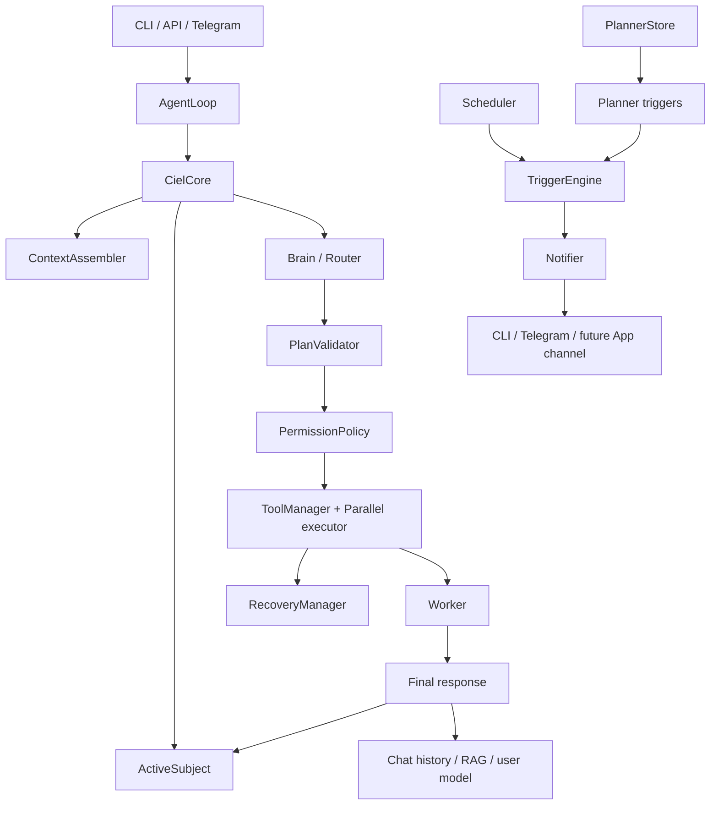

# Architecture — Ciel 2.0

## Design boundary

Ciel uses models for planning and language, while Python owns execution constraints.
The maintained topology has two model identities: Brain/Router and Worker. Optional
Router Assistant and Middleware paths do not change the core execution contract.

Three front ends call the same runtime:

```text
main.py ───────────┐
main_api.py ───────┼─> core.agent_loop.AgentLoop ─> core.llm_connector.CielCore
main_telegram.py ──┘
```

## Project map

```text
agent_system/
  config.py                    Environment-backed configuration
  models/brain.py              Routing, planning, and evaluation client
  models/worker.py             Conversation, generation, and synthesis client
  models/middleware.py         Optional outbound semantic verifier
  tools/buffer_writer.py       Legacy/generated-code support tool
  utils/logger.py              Structured thought logging
  utils/usage.py               Provider usage accounting

core/
  agent_loop.py                Thin request-loop facade used by entry points
  llm_connector.py             Central turn coordinator and compatibility bridge
  router.py                    Route parsing and intent normalization
  plan_validation.py           Pure pre-execution multi-tool validation
  continuation.py              Deterministic observe/re-plan policy and budgets
  parallel.py                  Dependency-aware, opt-in parallel execution
  permissions.py               AUTO/ASK/DENY/DEFER decisions and grants
  task_state.py                Durable job lifecycle and restart recovery
  context.py                   Bounded named-block context assembly
  active_subject.py            Compact RAM-only subject passed to Brain
  recovery_manager.py          Tool-error repair strategies
  notifier.py                  Delivery routing, budgets, cooldowns, dedupe
  triggers.py                  Deterministic condition checks and trigger engine
  proactive_setup.py           Shared CLI/API/Telegram trigger wiring
  planner_store.py             SQLite boundary for monthly and weekly plans
  planner_triggers.py          Monthly/weekly notification generation
  user_model.py                Bounded, secret-rejecting learned profile
  memory.py                    Long-term RAG storage and recall
  telegram_interface.py        Allow-list, uploads, confirmation, cancellation
  scheduler.py                 Background poll loop and legacy clock tasks

skills/
  _result.py                   Standard tool result envelope
  internal/*_ops.py            Files, reports, memory, todos, planner tools
  external/*_ops.py            Gmail, Telegram, web, trading, GitHub tools

ciel_data/                     Private persistent state, logs, RAG, planner DB
ciel_workspace/                Sandboxed working files and immediate todos
agent_output/                  Generated deliverables
backtest/                      Maintained regression and integration suites
scripts/
  prompt_harness.py            Audit/propose/apply CLI for prompt values
  harness_cli.cmd              Windows CMD wrapper for audit/review/propose/apply
  harness/                     Attribution, contract, sanitize, policy, model adapters, AST apply/rollback
                               and bounded full-project report generation
  harness_policy.json          Exact editable file::symbol allow-list
docker/                        Image, dependencies, and separate Compose services
ui/                            React/Tauri client
instructionAI/                 Stable project knowledge
```

## Dependency graph



## Turn lifecycle

1. The entry point receives one user message and marks the user as present.
2. `CielCore.process()` clears per-turn cancellation and outbound-delivery state.
3. Recent RAG recall, user-model traits, working-directory facts, and language hints
   enter `ContextAssembler` as separate prioritized blocks.
4. `ActiveSubject.begin_turn()` contributes one compact topic snapshot to the Brain.
   Recent raw turns are deliberately excluded from routing.
5. Brain returns `chat`, `tool`, `code`, or `multi_tool` JSON.
6. Deterministic route guards resolve explicit lookup follow-ups and block unsupported
   chat promises such as “I am searching now” without a tool execution handle.
7. Multi-tool plans are normalized and validated before permission review.
8. Permission policy resolves every call. An attended risky plan is confirmed before
   execution; an unattended risky call is deferred.
9. Independent, explicitly safe reads may run concurrently. Mutations, dependencies,
   unknown tools, and outbound deliveries remain sequential.
10. Tool results are checked for deterministic failure signals. Recovery may retry or
    select another loaded tool within bounded attempts.
11. Worker composes the final response from the real request and grounded results.
    Recent turns are available here, on the response side only.
12. The final response updates chat memory, optional user-model learning, and the
    Active Subject snapshot once.

## Model roles

### Brain/Router

Brain receives the user request, bounded non-conversational context, the compact active
subject, and loaded tool descriptions. It plans and evaluates but does not speak to the
user directly.

The chat route's `task` and hidden reasoning are hints for Worker. They cannot replace
the original user message. This keeps language matching, persona, and recent-turn
resolution in the response component that actually sees those inputs.

### Worker

Worker produces chat responses, code, tool-result explanations, and synthesized report
bodies. It receives recent conversation turns within a separate budget. It does not
decide whether a risky tool may execute.

### Optional roles

- Router Assistant can triage simple chat versus Brain-required work.
- Middleware can semantically review outbound email/report bodies after deterministic
  sanitization.

Both are disabled by default. Middleware is bounded and fail-open.

## Capability tiers

### Tier 1 — continuation

`ContinuationPolicy` converts deterministic evidence into another plan round. Scope
vetoes such as “only this” run before continuation signals. `LoopBudget` bounds rounds,
planner calls, and wall-clock time before every step.

### Tier 2 — durable task state

`TaskStore` persists job status and completed steps. Records left `active` across a
restart become `interrupted`; they are reported, not silently resumed. Task records do
not feed Brain routing.

### Tier 3 — permissions

`PermissionPolicy` resolves exact `(tool, arguments)` calls to `AUTO`, `ASK`, `DENY`, or
`DEFER`. A plan approval covers only the calls shown. Session grants cannot authorize a
different argument set or an unattended task.

### Tier 4 — context discipline

`ContextAssembler` accepts named blocks with priority and token estimates. Whole blocks
drop when the budget is exceeded. RAG recall is separately capped at its source.

Two narrow follow-up channels exist:

- `ActiveSubject` carries topic, grounded entities, and the last read action for a few
  turns.
- Active lookup state carries a query and at most three public URLs for an immediate
  explicit read/deepen request.

Neither is durable memory or permission state.

### Tier 5 — cancellation

`request_cancel()` sets a thread-safe event. The runtime checks it between steps and
closes the durable task as cancelled. A tool already running finishes atomically.

### Tier 6 — proactivity

`Scheduler` polls `TriggerEngine`; trigger checks are deterministic and use no model
unless a specific trigger explicitly composes a digest. `Notifier` enforces action
presence, daily budget, cooldown, repeat muting, and live-channel routing.

`core/proactive_setup.py` creates the same trigger stack for CLI, API, and Telegram.
The scheduler marks its execution thread unattended before trigger work.

### Tier 7 — user model

`UserModel` holds bounded preferences with provenance and decay. Stated traits outrank
inferred traits. Secret-like content is rejected before storage. Learning runs only
after a deterministic durable-preference gate and is daily-budgeted.

## Plan validation and parallel execution

Validation precedes permission review and execution:

```text
Brain plan
  -> loaded-tool check
  -> argument-object and schema check
  -> backward-reference check
  -> dependency-safe duplicate-delivery check
  -> permission review
  -> dependency levels
  -> parallel safe reads / sequential mutations
```

`{prev}` and `{step_N}` can reference earlier results only. A plan with an unknown tool,
forward dependency, malformed arguments, or unsafe duplicate renumbering stops as a
whole. Continuation plans use the same path.

## Planner architecture

Planning data is intentionally separate from memory:

```text
Monthly goal ─┐
              ├─> ciel_data/planner.db ─> PlannerStore ─> monthly/weekly tools
Weekly task ──┘                                  │
                                                └─> planner triggers ─> Notifier
Immediate todo ─> ciel_workspace/todos.json ────────────────┘
```

`monthly_goals` stores high-level outcomes. `weekly_tasks` stores concrete actions and
may reference a monthly goal. Adds use unique identities for retry idempotence;
completion changes status and retains history.

Monthly and weekly triggers are catch-up checks: once the configured local time has
passed, they may still announce later in that period. Stable period keys prevent a
successful message from repeating after a restart.

## Memory architecture

- Recent chat history supports Worker responses.
- ChromaDB recalls older semantic context.
- `facts.json` is explicit pull-only data and is never prompt-injected.
- `user_model.json` is bounded push context and cannot store secret-like values.
- `active_subject.py` is RAM-only session routing context.
- `tasks.json` tracks job execution, not conversation.
- `planner.db` tracks plans, not conversation.

See `data_pipeline.md` for data ownership and lifecycle.

## Entry points

### CLI

`main.py` provides interactive confirmation, Ctrl+C cancellation, optional STT/TTS,
and a live CLI presence channel for proactive messages.

### API/UI

`main_api.py` exposes REST and WebSocket endpoints. Confirmation uses a bounded
request/response exchange and fails closed when no client is attached or the response
times out.

### Telegram

`main_telegram.py` uses `core/telegram_interface.py`. The chat ID allow-list is checked
before a request reaches Ciel. Files enter `ciel_workspace/telegram_uploads/`; risky
tools use inline confirmation; `/cancel` requests step-boundary cancellation.

## Docker deployment

`docker/Dockerfile` builds one image. Separate Compose files select API or Telegram
commands and bind-mount private persistent state.

Important constraints:

- `COPY . .` places source in the image, so source updates require `--build`.
- `.env`, `credentials.json`, `ciel_data/`, `ciel_workspace/`, and `agent_output/` stay
  outside source deployment and survive recreation.
- Telegram has no HTTP health endpoint; `compose ps` and the bot-online log are its
  health signals.
- API and Telegram must not write the same state concurrently.
- Headless containers disable `vision_ops` unless a real display stack is supplied.
